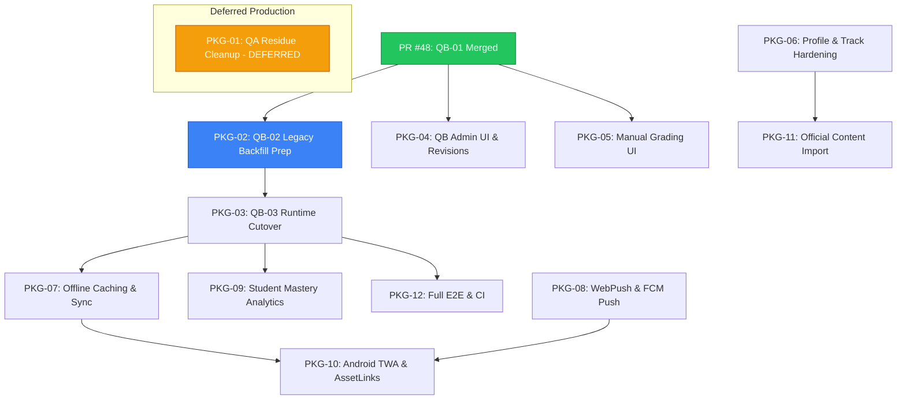

# STUDENT-APP-NEXT-12-PACKAGES-01
## أول 12 حزمة تنفيذ مرتبة حسب الاعتماد التقني وبوابة الإطلاق (Corrected 02)

- **التاريخ:** 2026-08-02
- **المشروع:** تطبيق طلاب الثانوية العامة (`msorori-mh/tas-heel-8e64d405`)
- **حالة العلاقات:** PR #48 `MERGED` في المستودع الرئيسي
- **الهدف:** تقديم خارطة طريق شاملة تنظم تنفيذ الحزم الـ 12 مع تحديد القيود والمخاطر والموافقات المطلوبة.

---

## 0. التمييز التشغيلي المستقل بين الحالات (Operational States Framework)

يتم الالتزام الدقيق بالتصنيفات التشغيلية التالية لكافة الحزم:
- **`source merged`**: الكود دُمج في main (مثل PR #48).
- **`source reviewed`**: كود المهاجرة والبرمجيات مراجع مصدرياً ومستندياً.
- **`local compilation`**: تجميع واختبار الكود والمهاجرة محلياً (Docker / Vitest).
- **`remote migration applied`**: تنفيذ المهاجرة فعلياً على قاعدة بيانات بعيدة (يتطلب موافقة المالك).
- **`production verified`**: التحقق في بيئة الإنتاج الحية بأدلة remote حصرية.

---

## 1. المسار الحرجة والحزمة التالية الموصى بها (Critical Path & Recommended Next Package)

### خارطة الطريق للمسار الحرجة (Critical Path):
```
[PR #48 Merged] (MERGED)
       │
       ▼
[QB-02 Import Foundation] (RECOMMENDED NEXT PACKAGE)
       │
       ▼
[Oracle / DB Review]
       │
       ▼
[Remote Apply & Cutover] (Requires Explicit Owner Approval)
```

> [!IMPORTANT]
> - **الحزمة التالية الموصى بها (Recommended Next Package):** **`QB-02 Import Foundation`** (تأسيس استيراد وترخيص البيانات القديمة محلياً).
> - **توضيح حزمة PKG-01 (QA Cleanup):**
>   - تبقى حزمة إنتاجية مؤجلة (`Deferred Production Package`).
>   - تتطلب موافقة صريحة من المالك.
>   - **يُحظر تماماً بدء تنفيذ PKG-01 أثناء عمل أو تنفيذ حزمة QB-02**.

---

## 2. مخطط الاعتمادات للحزم الـ 12 (Dependency Graph)



---

## 3. تفاصيل ومصفوفة الخصائص للحزم الـ 12 (The 12 Packages Matrix & Specs)

### مصفوفة المقارنة الفورية للحزم الـ 12:

| الحزمة | Requires QB-01 Merged? | Requires Remote Apply? | Requires Owner Approval? | Requires Content? | Requires Migration? | Can Run in Parallel? | Production Risk? |
|---|---|---|---|---|---|---|---|
| **PKG-01** | NO | YES | **YES** | NO | YES | **NO** (Blocked by QB-02) | HIGH |
| **PKG-02** | **YES** | NO (Local prep) | YES (for Remote) | NO | YES | NO | HIGH (Remote) / LOW (Local) |
| **PKG-03** | YES | YES | YES | NO | YES | NO | HIGH |
| **PKG-04** | YES | NO | NO | NO | NO | **YES** (Wave A) | LOW |
| **PKG-05** | YES | NO | NO | NO | NO | **YES** (Wave A) | LOW |
| **PKG-06** | NO | NO | NO | NO | YES (Local) | **YES** (Wave A) | LOW |
| **PKG-07** | YES | NO | NO | NO | NO | **YES** (Wave A) | LOW |
| **PKG-08** | NO | NO | NO | NO | YES (Local) | **YES** (Wave A) | LOW |
| **PKG-09** | YES | NO | NO | NO | NO | **YES** (Wave A) | LOW |
| **PKG-10** | YES | NO | NO | NO | NO | **YES** (Wave A) | LOW |
| **PKG-11** | YES | YES | YES | **YES** | NO | NO | MEDIUM |
| **PKG-12** | YES | NO | NO | NO | NO | **YES** (Wave A) | LOW |

---

### التفاصيل التفصيلية لكل حزمة:

#### 1. PKG-01: QA Data Cleanup & Pre-Import Hygiene (تنظيف بيانات QA المتخلفة)
- **الهدف:** تنظيف بيئة الإنتاج من وحدات وتجارب QA المتروكة (`QA_C01_C02_FREE_UNIT`, `QA_C01_C02_PAID_UNIT`) والمادة التابعة لها.
- **الحالة:** `Deferred Production Package` (مؤجلة).
- **القيود الصارمة:** **لا تُنفذ أثناء العمل على QB-02**.
- **المعايير المحددة:**
  - `Requires QB-01 merged?`: NO
  - `Requires remote apply?`: YES
  - `Requires owner approval?`: **YES (موافقة صريحة مطلوبة)**
  - `Requires content?`: NO
  - `Requires migration?`: YES (`20260802000000_cleanup_qa_residue.sql`)
  - `Can run in parallel?`: NO
  - `Production risk?`: HIGH
- **Acceptance:** استعلام الكشف ينتهي بنتيجة 0 صفوف لبيانات QA.

---

#### 2. PKG-02: QB-02 Legacy Data Backfill & Revision 1 Foundation (تأسيس ترحيل الأسئلة القديمة)
- **الهدف:** إعداد مهاجرة ترحيل الأسئلة القديمة من `questions` إلى `question_revisions` (الإصدار #1) وتوليد التوقيع الرقمي `payload_hash` واختبار التجميع محلياً.
- **المعايير المحددة:**
  - `Requires QB-01 merged?`: **YES (PR #48 MERGED)**
  - `Requires remote apply?`: NO (لمرحلة التأسيس والاختبار المحلي) / YES (عند التطبيق النهائي)
  - `Requires owner approval?`: YES (للتطبيق البعيد)
  - `Requires content?`: NO
  - `Requires migration?`: YES (`20260802120000_qb02_legacy_questions_backfill.sql`)
  - `Can run in parallel?`: NO
  - `Production risk?`: HIGH (عند الترحيل البعيد) / LOW (أثناء التأسيس المحلي)
- **Acceptance:** اجتياز 100% من اختبارات التوقيع الهيكلي والتحويل المكتبي محلياً.

---

#### 3. PKG-03: QB-03 Runtime Activation & Snapshot Cutover (تفعيل البنك في محرك الاختبارات)
- **الهدف:** تفعيل دوال اللقطات المجمّدة تحويل `attempt_pin_mode` إلى `QUESTION_BANK`.
- **المعايير المحددة:**
  - `Requires QB-01 merged?`: YES
  - `Requires remote apply?`: YES
  - `Requires owner approval?`: YES
  - `Requires content?`: NO
  - `Requires migration?`: YES (`20260803120000_qb03_runtime_cutover.sql`)
  - `Can run in parallel?`: NO
  - `Production risk?`: HIGH
- **Acceptance:** نجاح إنشاء ودراسة وتصحيح 10 جلسات اختبار بالنمط الجديد بدون أخطاء RLS.

---

#### 4. PKG-04: Question Bank Admin UI & Multi-Revision Editor (واجهة إدارة بنك الأسئلة)
- **الهدف:** تطوير شاشة `admin.questions.tsx` لدعم تحرير Revisions، باني خطوات الحل، ومعاينة KaTeX.
- **المعايير المحددة:**
  - `Requires QB-01 merged?`: YES
  - `Requires remote apply?`: NO
  - `Requires owner approval?`: NO
  - `Requires content?`: NO
  - `Requires migration?`: NO
  - `Can run in parallel?`: **YES (Wave A)**
  - `Production risk?`: LOW
- **Acceptance:** استطاعة مدير المحتوى إنشاء مسودة سؤال، مراجعتها، ونشرها عبر الواجهة.

---

#### 5. PKG-05: Manual Grading Engine & Review Queue UI (سطح التصحيح اليدوي)
- **الهدف:** بناء شاشة `admin.grading.tsx` لمراجعة وتصحيح إجابات الطلاب المقالية النصية.
- **المعايير المحددة:**
  - `Requires QB-01 merged?`: YES
  - `Requires remote apply?`: NO
  - `Requires owner approval?`: NO
  - `Requires content?`: NO
  - `Requires migration?`: NO (المخطط موجود في QB-01)
  - `Can run in parallel?`: **YES (Wave A)**
  - `Production risk?`: LOW
- **Acceptance:** تحديث الدرجة النهائية للطالب فور إتمام عملية التصحيح اليدوي في الواجهة.

---

#### 6. PKG-06: Curriculum Tracks & Profile Academic Hardening (تعزيز المسارات والأكاديميات)
- **الهدف:** إضافة اختيار المسار التعليمي (علمي/أدبي) للصفين 11 و 12 في استكمال الملف الشخصي.
- **المعايير المحددة:**
  - `Requires QB-01 merged?`: NO
  - `Requires remote apply?`: NO (محلياً حالياً)
  - `Requires owner approval?`: NO
  - `Requires content?`: NO
  - `Requires migration?`: YES (`20260804120000_add_track_to_profiles.sql`)
  - `Can run in parallel?`: **YES (Wave A)**
  - `Production risk?`: LOW
- **Acceptance:** تصفية وعرض المواد الصحيحة للطالب بناءً على مساره المختار.

---

#### 7. PKG-07: Offline Content Caching & Sync Engine (التخزين المحلي والمزامنة)
- **الهدف:** تحميل دروس وتمارين المادة محلياً في المتصفح عبر IndexedDB ومزامنة المحاولات عند عودة الاتصال.
- **المعايير المحددة:**
  - `Requires QB-01 merged?`: YES
  - `Requires remote apply?`: NO
  - `Requires owner approval?`: NO
  - `Requires content?`: NO
  - `Requires migration?`: NO
  - `Can run in parallel?`: **YES (Wave A)**
  - `Production risk?`: LOW
- **Acceptance:** تقديم التمارين بدون اتصال بالشبكة بنجاح 100% ومزامنة النتيجة فور إعادة الاتصال.

---

#### 8. PKG-08: WebPush & FCM Notifications Infrastructure (نظام الإشعارات الفورية)
- **الهدف:** ربط نظام الإشعارات مع WebPush / FCM لتنفيذ التنبيهات الفورية الهواتف.
- **المعايير المحددة:**
  - `Requires QB-01 merged?`: NO
  - `Requires remote apply?`: NO
  - `Requires owner approval?`: NO
  - `Requires content?`: NO
  - `Requires migration?`: YES (`20260805120000_push_subscriptions.sql`)
  - `Can run in parallel?`: **YES (Wave A)**
  - `Production risk?`: LOW
- **Acceptance:** استلام إشعار تجريبي على شاشة الجوال بنجاح أثناء إغلاق التطبيق.

---

#### 9. PKG-09: Student Mastery Analytics Dashboard (لوحة تحليلات الإتقان)
- **الهدف:** بناء لوحة تحليلات الطالب لإظهار نقاط القوة والضعف ومستويات بلوم.
- **المعايير المحددة:**
  - `Requires QB-01 merged?`: YES
  - `Requires remote apply?`: NO
  - `Requires owner approval?`: NO
  - `Requires content?`: NO
  - `Requires migration?`: NO
  - `Can run in parallel?`: **YES (Wave A)**
  - `Production risk?`: LOW
- **Acceptance:** عرض رسم بياني دقيق يحدد موضوعات الضعف بعد إتمام 3 تمارين.

---

#### 10. PKG-10: Android TWA & Digital Asset Links Packaging (حزمة تطبيق أندرويد)
- **الهدف:** إضافة `.well-known/assetlinks.json` وتهيئة غلاف TWA للنشر على متجر Play.
- **المعايير المحددة:**
  - `Requires QB-01 merged?`: YES
  - `Requires remote apply?`: NO
  - `Requires owner approval?`: NO
  - `Requires content?`: NO
  - `Requires migration?`: NO
  - `Can run in parallel?`: **YES (Wave A)**
  - `Production risk?`: LOW
- **Acceptance:** اجتياز فحص Google Play Console واستخراج حزمة AAB جاهزة للنشر.

---

#### 11. PKG-11: Official Content Import Execution (تنفيذ استيراد المحتوى الرسمي)
- **الهدف:** تشغيل استيراد المحتوى التعليمي الرسمي للمنهج اليمني بعد اجتياز dry-run بنسبة 100%.
- **المعايير المحددة:**
  - `Requires QB-01 merged?`: YES
  - `Requires remote apply?`: YES
  - `Requires owner approval?`: YES
  - `Requires content?`: **YES (الملفات 01-09 الرسمية)**
  - `Requires migration?`: NO
  - `Can run in parallel?`: NO
  - `Production risk?`: MEDIUM
- **Acceptance:** استيراد جميع المواد المعتمدة بنسبة 100% بدون خطأ مرجعي واحد.

---

#### 12. PKG-12: Full E2E Test Suite & CI Automation (أتمتة الاختبارات الشاملة)
- **الهدف:** بناء اختبارات Playwright E2E وتوسيع GitHub Actions ليشمل جميع فحوصات البنك والـ Linting.
- **المعايير المحددة:**
  - `Requires QB-01 merged?`: YES
  - `Requires remote apply?`: NO
  - `Requires owner approval?`: NO
  - `Requires content?`: NO
  - `Requires migration?`: NO
  - `Can run in parallel?`: **YES (Wave A)**
  - `Production risk?`: LOW
- **Acceptance:** نجاح 100% لكافة الاختبارات في GitHub Actions وزمن تنفيذ أقل من 10 دقائق.

---

## 4. توزيع خطة الموجتين (Two-Wave Execution Breakdown)

### الموجة A (Wave A: Non-Production Parallel Work):
- **تضم:** PKG-04, PKG-05, PKG-06, PKG-07, PKG-08, PKG-09, PKG-10, PKG-12.
- **الهدف:** يمكن البدء بتطويرها فوراً بشكل متوازٍ لأنها لا تمس بيانات الإنتاج البعيدة وتعمل في النطاق المحلي / واجهات العميل.

### الموجة B (Wave B: Work Requiring Remote Approval):
- **تضم:** QB-01 Remote Apply, PKG-02 (Remote execution), PKG-03, PKG-01 (Deferred QA Cleanup), PKG-11.
- **الهدف:** تنفذ بالتتابع وتتطلب موافقة صريحة لكل خطوة قبل التشغيل على سيرفر الإنتاج البعيد.
