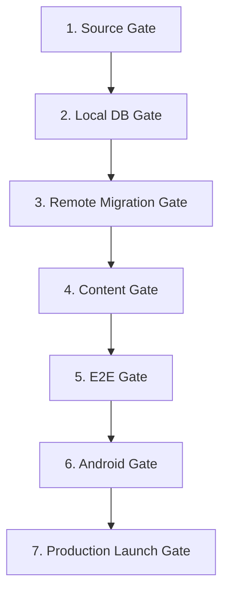

# STUDENT-APP-RELEASE-GAP-AUDIT-01
## تدقيق الفجوات والجاهزية لتطبيق الطلاب بعد تأسيس بنك الأسئلة (Read-Only Audit - Corrected 02)

- **التاريخ:** 2026-08-02
- **المشروع:** تطبيق طلاب الثانوية العامة (`msorori-mh/tas-heel-8e64d405`)
- **الـ HEAD المراجع:** `93127008143fc9ab1e37096c47a60cf93809dcda`
- **حالة العلاقات:** PR #48 `MERGED` على المستودع الرئيسي
- **نوع التدقيق:** Read-only Audit (تدقيق مستندي بدون تغيير كود مصدري أو تطبيق مهاجرات أو تنفيذ SQL)
- **القرار الكلي:** `PASS_WITH_NOTES`

---

## 0. التمييز التشغيلي المستقل بين الحالات (Operational States Framework)

لضمان الدقة وتجنب خلط المفاهيم، يتم اعتماد التمييز الصارم بين الحالات التشغيلية التالية عبر كافة وثائق التدقيق:

| الحالة التشغيلية | التعريف الدقيق | الموقف في هذا التدقيق |
|---|---|---|
| **`source merged`** | دمج المهاجرات والأكواد المعتمدة في الفرع الرئيسي للمستودع (Main Branch). | **مطبق:** PR #48 مدموج في الفرع الرئيسي. |
| **`source reviewed`** | مراجعة الكود البرمجي والمهاجرات مستندياً والتأكد من مطابقة المعايير. | **مطبق:** كود QB-01 ومهاجرات الأمان مراجعة 100%. |
| **`local compilation`** | تجميع واختبار الكود والمهاجرات محلياً عبر Docker/Vitest. | **مطبق:** اجتياز 37/37 اختبار QB-01 و 12/12 Golden Hash. |
| **`remote migration applied`** | تنفيذ المهاجرة فعلياً على قاعدة بيانات بعيدة (Staging / Production). | **غير مطبق:** لم يتم تطبيق QB-01 على قاعدة بعيدة بعد. |
| **`production verified`** | التحقق المستقل من عمل الخدمة في بيئة الإنتاج الحية بأدلة remote. | **غير مطبق:** لا يوجد دليل Remote مستقل لحين التطبيق الفعلي. |

> [!IMPORTANT]
> - **تنبيه QB-01:** بنك الأسئلة QB-01 في حالة `source merged` و `source reviewed` و `local compilation` فقط. **لم يُطبق على قاعدة البيانات البعيدة/الإنتاجية بعد**، وينموذج التشغيل الحالي لا يزال `LEGACY`.
> - **تنبيه الإصلاحات الأمنية:** الإصلاحات الأمنية مراجعة مصدرياً ومختبرة محلياً (`source reviewed` / `local compilation`)؛ ولا يمكن إعلان تطبيقها إنتاجياً بدون دليل مستقل من سيرفر قاعدة البيانات البعيدة (`remote migration applied`).

---

## 1. تصنيف الفجوات والنتائج (Audit Findings Summary)

### ملخص النتائج حسب الخطورة:
- **CRITICAL:** 0 (لا توجد فجوات حرجة تعطل البناء الحالي)
- **HIGH:** 4 فجوات نشطة
- **MEDIUM:** 9 فجوات نشطة
- **CLOSED / REMOVED:** تم استبعاد المشاكل المغلقة سابقاً (مثل قفل استعلام `units` للزوار في `20260731180000`, وتشفير إجابات الاختبارات في `20260731120000`, ومزامنة lockfile) وعدم تكرارها كفجوات نشطة.

---

## 2. تفاصيل النتائج العالية والمتوسطة المتبقية (Active Findings with File Evidence)

### أ. الفجوات عالية الخطورة (HIGH Findings - 4)

1. **تأخير تطبيق بنك الأسئلة على السيرفر البعيد (QB-01 Remote Apply & Cutover Pending)**
   - **الخطورة:** `HIGH`
   - **الدليل المكتبي:** [`supabase/migrations/20260801120000_qb01_question_bank_schema_foundation.sql`](file:///C:/projects/tas-heel-8e64d405-release-gap-audit-01/supabase/migrations/20260801120000_qb01_question_bank_schema_foundation.sql), [`src/routes/_authenticated/exams.strict.$templateId.tsx`](file:///C:/projects/tas-heel-8e64d405-release-gap-audit-01/src/routes/_authenticated/exams.strict.$templateId.tsx#L85-L110).
   - **الوصف:** المهاجرة QB-01 مدموجة مصدرياً (`source merged`) ومختبرة محلياً (`local compilation`) لكنها لم تُطبق على القاعدة البعيدة (`remote migration applied = NO`). دوال إنشاء الجلسات بالبنك (`create_exam_session_with_snapshot`) لا تزال مغلقة بحالة Fail-closed، ونمط التشغيل العام يظل `LEGACY`.
   - **المخاطر:** المخاطر الحالية: استمرار استخدام النظام القديم غير المحمي باللقطات المجمّدة. المخاطر المؤجلة: تعارض البيانات أثناء Cutover في حال تأخر ترحيل الأسئلة القديمة.

2. **غياب واجهات وصفحة التصحيح اليدوي للأسئلة المقالية (Manual Grading Engine UI Missing)**
   - **الخطورة:** `HIGH`
   - **الدليل المكتبي:** مخطط `question_response_reviews` موجود في [`supabase/migrations/20260801120000_qb01_question_bank_schema_foundation.sql#L140-L180`](file:///C:/projects/tas-heel-8e64d405-release-gap-audit-01/supabase/migrations/20260801120000_qb01_question_bank_schema_foundation.sql#L140-L180)، لكن السطح التفاعلي غائب كلياً في [`src/routes/_authenticated/admin.grading.tsx`](file:///C:/projects/tas-heel-8e64d405-release-gap-audit-01/src/routes/_authenticated/).
   - **الوصف:** المخطط الهيكلي لقاعدة البيانات يتيح التصحيح اليدوي عبر جدول `question_response_reviews` ودالة `can_grade_manual_response` ولكن لا يوجد كود في لوحة التحكم أو واجهة الطالب لدعم إدخال وتصحيح الإجابات المقالية.
   - **المخاطر:** عدم القدرة على إجراء اختبارات تحتوي أسئلة مقالية أو نصية قصيرة حتى إكمال PKG-05.

3. **محدودية التخزين المحلي والمزامنة بدون إنترنت (Offline Caching & Sync Limited)**
   - **الخطورة:** `HIGH`
   - **الدليل المكتبي:** [`public/sw.js#L1-L45`](file:///C:/projects/tas-heel-8e64d405-release-gap-audit-01/public/sw.js#L1-L45)، [`src/lib/pwa/registerSW.ts`](file:///C:/projects/tas-heel-8e64d405-release-gap-audit-01/src/lib/pwa/registerSW.ts).
   - **الوصف:** التخزين المؤقت في Service Worker يقيد الاستجابة على الهيكل الأساسي (App Shell) وصفحة `/offline.html`. لا يوجد بنية محددة للتخزين المحلي (IndexedDB) للدروس والتمارين، ولا توجد مزامنة خلفية عند انقطاع الشبكة.
   - **المخاطر:** توقف تجربة التمارين والتعلم عند ضعف تغطية 3G/2G في البيئة اليمنية.

4. **غياب ملف الربط الرقمي وحزمة أندرويد (Android TWA Readiness & Asset Links Missing)**
   - **الخطورة:** `HIGH`
   - **الدليل المكتبي:** [`public/manifest.webmanifest`](file:///C:/projects/tas-heel-8e64d405-release-gap-audit-01/public/manifest.webmanifest)، عدم توفر ملف [`public/.well-known/assetlinks.json`](file:///C:/projects/tas-heel-8e64d405-release-gap-audit-01/public/.well-known/).
   - **الوصف:** التطبيق يحتوي على ملف manifest ولكن يفتقر لملف Digital Asset Links المعتمد لربط النطاق بحزمة أندرويد وتسهيل نشر غلاف TWA على متجر Google Play.
   - **المخاطر:** عدم التمكن من رفع التطبيق على متجر أندرويد كـ Native-like App بدون هذا الملف.

---

### ب. الفجوات متوسطة الخطورة (MEDIUM Findings - 9)

1. **نقص اختيار المسارات الدراسية في الملف الشخصي (Curriculum Tracks & Profile Hardening)**
   - **الدليل المكتبي:** [`src/routes/_authenticated/complete-profile.tsx#L40-L110`](file:///C:/projects/tas-heel-8e64d405-release-gap-audit-01/src/routes/_authenticated/complete-profile.tsx#L40-L110)، [`src/lib/subject-semester.ts`](file:///C:/projects/tas-heel-8e64d405-release-gap-audit-01/src/lib/subject-semester.ts).
   - **الوصف:** عدم إتاحة اختيار المسار (علمي/أدبي) للصفين 11 و 12 في شاشة استكمال الملف الشخصي، والاعتماد على تسميات نصية بدلاً من ربط مستقل بالمسارات.

2. **اعتماد محرك التمارين القديم والتوقيت المحلي (Legacy Practice Engine & Client Clock)**
   - **الدليل المكتبي:** [`src/routes/_authenticated/exams.strict.$templateId.tsx#L90-L130`](file:///C:/projects/tas-heel-8e64d405-release-gap-audit-01/src/routes/_authenticated/exams.strict.$templateId.tsx#L90-L130)، [`src/routes/_authenticated/units.$unitId.practice.tsx`](file:///C:/projects/tas-heel-8e64d405-release-gap-audit-01/src/routes/_authenticated/units.$unitId.practice.tsx).
   - **الوصف:** محاولات التمرين لا تزال تستخدم الجدول القديم `unit_practice_attempts` بدلاً من لقطات البنك المجمّدة، واحتساب وقت الاختبار الصارم عند الانقطاع يعتمد على توقيت الجهاز المحلي قبل المصادقة مع السيرفر.

3. **غياب التراجعات الذرية الشاملة في محرك استيراد المحتوى (Content Import Multi-file Rollback)**
   - **الدليل المكتبي:** [`scripts/content-import/validate-content-package.mjs#L1-L200`](file:///C:/projects/tas-heel-8e64d405-release-gap-audit-01/scripts/content-import/validate-content-package.mjs#L1-L200)، [`docs/CONTENT-IMPORT-DRY-RUN-RUNBOOK-01.md`](file:///C:/projects/tas-heel-8e64d405-release-gap-audit-01/docs/CONTENT-IMPORT-DRY-RUN-RUNBOOK-01.md).
   - **الوصف:** محرك الاستيراد لا يوفر Rollback ذري شامل عند فشل أحد الملفات الـ 9 في منتصف العملية مما يتطلب تنظيفاً يدوياً إذا لم يُنفذ dry-run مسبقاً.

4. **اعتماد شحن المحفظة على الموافقة اليدوية وغياب البوابات الآلية (Manual Wallet Top-up & Payment Gateway)**
   - **الدليل المكتبي:** [`src/routes/_authenticated/admin.wallet-topups.tsx#L30-L90`](file:///C:/projects/tas-heel-8e64d405-release-gap-audit-01/src/routes/_authenticated/admin.wallet-topups.tsx#L30-L90)، [`supabase/migrations/20260705101800_wallet_receipts.sql`](file:///C:/projects/tas-heel-8e64d405-release-gap-audit-01/supabase/migrations/).
   - **الوصف:** طلبات شحن الحساب تتطلب مراجعة بشرية للإيصالات المرفوعة غياب الربط البرمجي المباشر مع بوابات الدفع الإلكتروني اليمنية (حاسب / الكريمي / الفلوس الذكية).

5. **غياب الإشعارات الفورية واعتماد البريد على السجلات الحافظة (Push Notifications & Production SMTP)**
   - **الدليل المكتبي:** [`src/routes/_authenticated/admin.notifications.tsx`](file:///C:/projects/tas-heel-8e64d405-release-gap-audit-01/src/routes/_authenticated/admin.notifications.tsx)، [`supabase/migrations/20260705120000_notifications.sql`](file:///C:/projects/tas-heel-8e64d405-release-gap-audit-01/supabase/migrations/).
   - **الوصف:** عدم دعم WebPush / FCM، وإرسال البريد الإلكتروني يعتمد على التدوين في جدول `email_send_log` بدون مزود SMTP خارجي حي (مثل Resend / SendGrid).

6. **ضعف آليات التعامل مع انقطاع الشبكة وضغط الصور (Low Bandwidth Resilience & Image Optimization)**
   - **الدليل المكتبي:** [`src/lib/supabase.ts`](file:///C:/projects/tas-heel-8e64d405-release-gap-audit-01/src/lib/supabase.ts)، [`src/components/ui/image.tsx`](file:///C:/projects/tas-heel-8e64d405-release-gap-audit-01/src/components/ui/).
   - **الوصف:** غياب آلية Re-try الذكية مع Exponential Backoff لطلبات الشبكة عند بطء الاتصال، وعدم تحويل الصور تلقائياً لصيغ WebP/AVIF المتجاوبة.

7. **إمكانية الاستعلام عن جدول الأسئلة القديم وتشديد سلات التخزين (Legacy Question SELECT & Storage Buckets)**
   - **الدليل المكتبي:** [`supabase/migrations/20260731120000_exam_answers_postgrest_leak_hardening.sql`](file:///C:/projects/tas-heel-8e64d405-release-gap-audit-01/supabase/migrations/20260731120000_exam_answers_postgrest_leak_hardening.sql).
   - **الوصف:** بالرغم من سحب عمود الإجابة الصحيحة، فإن الجدول القديم `questions` يتيح استعلام SELECT للطلاب المسجلين. سلات التخزين تتطلب أيضاً تشديد فحص MIME types لإيصالات الدفع.

8. **واجهة إدارة الأسئلة الحالية لا تدعم النسخ المتعددة أو المعاينة الحية (Single-revision Question Admin & KaTeX)**
   - **الدليل المكتبي:** [`src/routes/_authenticated/admin.questions.tsx#L50-L180`](file:///C:/projects/tas-heel-8e64d405-release-gap-audit-01/src/routes/_authenticated/admin.questions.tsx#L50-L180).
   - **الوصف:** الواجهة القديمة غير مهيأة لإدارة Revisions البنك الجديد أو معاينة معادلات KaTeX مباشرة أثناء كتابة السؤال.

9. **معلقة تنظيف بيانات QA التجريبية على موافقة المالك (QA Residue Cleanup Pending Signoff)**
   - **الدليل المكتبي:** [`docs/RELEASE-STABILITY-SNAPSHOT-01.md#L15-L35`](file:///C:/projects/tas-heel-8e64d405-release-gap-audit-01/docs/RELEASE-STABILITY-SNAPSHOT-01.md#L15-L35)، [`docs/QA-RESIDUE-CLEANUP-PREFLIGHT-01.md`](file:///C:/projects/tas-heel-8e64d405-release-gap-audit-01/docs/QA-RESIDUE-CLEANUP-PREFLIGHT-01.md).
   - **الوصف:** وجود الوحدتين التجريبيتين (`QA_C01_C02_FREE_UNIT` و `QA_C01_C02_PAID_UNIT`) في بيئة الإنتاج الحية، ويتطلب تنظيفهما موافقة صريحة جداً وتنسيقاً عالي الأمان.

---

## 3. المسار الحرجة والحزمة التالية الموصى بها (Critical Path & Recommended Next Package)

### المسار الحرجة المعتمد (Critical Path):
1. **[مكتمل] إكمال دمج PR #48:** تم دمج كود ومهاجرة بنك الأسئلة الأساسي QB-01 بنجاح في الفرع الرئيسي (`source merged`).
2. **[الحزمة التالية الحالية] تأسيس استيراد وتجهيز الترحيل (QB-02 Import Foundation):** بناء سكربت ومهاجرة ترحيل الأسئلة القديمة إلى Revisions توليد التوقيع الرقمي `payload_hash` واختبارها محلياً.
3. **مراجعة ميكانيكية داتا بايز (Oracle / Database Review):** فحص الفهارس والأداء وصحة الدوال المكتوبة.
4. **التطبيق البعيد والترحيل (Remote Apply & Backfill/Cutover):** يتم تنفيذه لاحقاً في مرحلة مستنيرة فقط بطلب وموافقة صريحة من المالك.

> [!CAUTION]
> **الحزمة التالية الموصى بها (Recommended Next Package):**
> **`QB-02 Import Foundation`** (وليس QA Production Cleanup).
> 
> **توضيح حزمة PKG-01 (QA Cleanup):**
> - تبقى حزمة إنتاجية مؤجلة (`Deferred Production Package`).
> - تتطلب موافقة صريحة وخاصة من المالك قبل التشغيل على سيرفر الإنتاج.
> - **يُحظر بدء تنفيذ PKG-01 أثناء عمل وحزمة QB-02**.

---

## 4. بوابات الإطلاق السبع (The 7 Release Gates)

لضمان سلامة وسلاسة الانتقال لبيئة الإنتاج، تم تحديد 7 بوابات إطلاق ملزمة:



1. **Source Gate (بوابة المصدر):** دمج العلاقات في main، اجتياز `npm test` و `npm run test:question-bank-hash` و خلو الكود من خطط التجميع والـ Lint.
2. **Local DB Gate (بوابة قاعدة البيانات المحلية):** تطبيق كافة المهاجرات على حاوية Docker محلياً واجتياز فحوصات التشفير والهيكل بنسبة 100%.
3. **Remote Migration Gate (بوابة المهاجرة البعيدة):** الحصول على موافقة المالك، ثم تطبيق المهاجرات على السيرفر البعيد والتحقق المستقل من جداول ودوال البنك.
4. **Content Gate (بوابة المحتوى):** اجتياز `validate-content-package.mjs` بنتيجة 0 أخطاء و 0 تحذيرات، وتدقيق القوالب 01-09 الرسمية.
5. **E2E Gate (بوابة الاختبارات الشاملة):** اجتياز Playwright E2E suite لكامل مسارات الطالب والمدير في بيئة موازية.
6. **Android Gate (بوابة أندرويد):** تأكيد توفر `assetlinks.json` واجتياز التوقيع الرقمي وفحوصات غلاف TWA لمتجر Google Play.
7. **Production Launch Gate (بوابة الإطلاق النهائي):** التوقيع النهائي، تحويل `attempt_pin_mode` إلى `QUESTION_BANK` وفتح التسجيل العام.

---

## 5. خطة التنفيذ المزدوجة (Two-Wave Execution Plan)

لتوفير أقصى درجات الفعالية مع حماية بيئة الإنتاج الحية، تُقسم الحزم الـ 12 إلى موجتين:

```
+-----------------------------------------------------------------------------------+
|                            WAVE A: Non-Production Parallel                        |
| (PKG-04, PKG-05, PKG-06, PKG-07, PKG-08, PKG-09, PKG-10, PKG-12)                   |
| -> التجميع، الواجهات، الأندرويد، التخزين المحلي، التحليلات، الاختبارات الشاملة  |
+-----------------------------------------------------------------------------------+
                                         |
                                         v
+-----------------------------------------------------------------------------------+
|                         WAVE B: Remote Approval & Production                      |
| (QB-01 Remote Apply, PKG-02, PKG-03, PKG-01 [Deferred], PKG-11)                  |
| -> تطبيق المهاجرات البعيدة، الترحيل، التحويل، تنظيف QA المؤجل، الاستيراد الرسمي  |
+-----------------------------------------------------------------------------------+
```

### الموجة الأولى (Wave A: Parallel Non-Production Work):
- **طبيعتها:** تطوير كود، واجهات، واختبارات لا تؤثر على قاعدة البيانات الحية البعيدة ولا تتطلب موافقة إنتاجية.
- **الحزم التابعة:**
  - `PKG-04`: واجهة إدارة بنك الأسئلة والتعديل متعدد النسخ.
  - `PKG-05`: سطح التصحيح اليدوي ومراجعة الأسئلة المقالية.
  - `PKG-06`: تعزيز اختيار المسارات وإعدادات الملف الشخصي.
  - `PKG-07`: محرك التخزين المحلي المتقدم (IndexedDB) والمزامنة.
  - `PKG-08`: بنية الإشعارات الفورية (WebPush / FCM).
  - `PKG-09`: لوحة تحليلات تقييم الإتقان حسب بلوم.
  - `PKG-10`: حزمة أندرويد وربط `assetlinks.json`.
  - `PKG-12`: أتمتة الاختبارات الشاملة (E2E) وخط الإنتاج CI.

### الموجة الثانية (Wave B: Work Requiring Remote Approval):
- **طبيعتها:** عمليات تتطلب التعديل أو الكتابة أو تطبيق المهاجرات على السيرفر البعيد وتتطلب موافقة صريحة.
- **الحزم التابعة:**
  - `QB-01 Remote Apply`: تطبيق مهاجرة البنك الهيكلية على السيرفر البعيد.
  - `PKG-02`: ترحيل الأسئلة القديمة وتوليد التوقيعات (QB-02 Backfill).
  - `PKG-03`: تحويل محرك التشغيل وإغلاق النظام القديم (QB-03 Cutover).
  - `PKG-01`: تنظيف بيانات QA المتخلفة (**حزمة إنتاجية مؤجلة جداً تُنفذ منفردة بموافقة صريحة**).
  - `PKG-11`: استيراد المحتوى التعليمي الرسمي الحقيقي للمنهج.

---

## 6. جدول حالة الجاهزية الكلية (Release Readiness Sign-off Matrix)

| المحور | الحالة التشغيلية | ملاحظات الجاهزية ومتطلبات البوابة |
|---|---|---|
| **الاستقرار والتجميع** | `local compilation PASS` | 0 أخطاء تجميع، اجتياز جميع اختبارات الوحدة. |
| **بنك الأسئلة (QB-01)** | `source merged` (PR #48) | مدمج مصدرياً، ينتظر التطبيق البعيد (`Remote Migration Gate`). |
| **الإصلاحات الأمنية** | `source reviewed PASS` | مراجعة مصدرياً ومحلياً، في انتظار الدليل البعيد. |
| **الحزمة التالية** | `QB-02 Import Foundation` | البدء بتأسيس واختبار ترحيل الأسئلة محلياً. |
| **تنظيف QA** | `Deferred Production` | مؤجلة ومفصولة عن QB-02 وتتطلب موافقة كتابية صريحة. |
| **القرار النهائي** | `PASS_WITH_NOTES` | **الأساس المصدري جاهز للانتقال لتنفيذ الموجة A بالتوازي وتجهيز QB-02.** |
