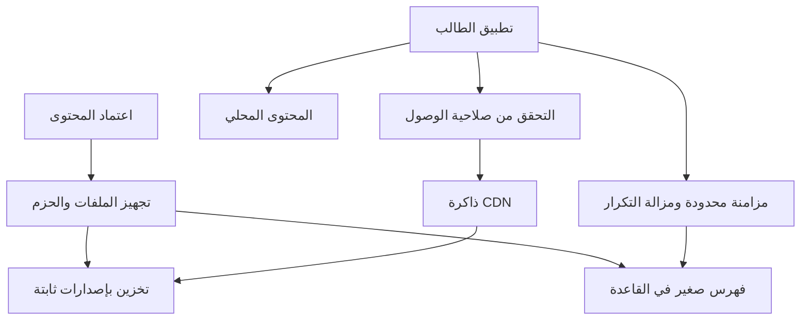

# تمكين الطالب: تقييم التحمل وخيارات التوسع

مرجع العمل: قياسات ومراجعة أسعار بتاريخ 14 سبتمبر 2026. الأسعار راجعتها من صفحات المزودين الرسمية خلال هذه المراجعة؛ تتغير ويجب إعادة تأكيدها قبل الشراء.

**الحكم التنفيذي:** التحسينات الحالية خطوة مفيدة، لكن لا توجد حتى الآن نتيجة تسمح باعتماد التطبيق لعشرات الآلاف من الطلاب المتزامنين. أوصي بالحفاظ على التطبيق وتصميمه، واعتماد الأوفلاين من الإعدادات، ثم فصل الملفات التعليمية عن قاعدة البيانات وتجهيز حزمها عند النشر. يتبع ذلك قياس على البنية المرشحة قبل تحديد حجم الخادم أو فتح التسجيل الواسع.

نفّذ العمل على فروع مراجعة. لم تُطبق ترقية السعة على قاعدة الموقع الأصلي، ولم تُرفع هذه النسخة إلى Google Play. رقم 50 ألف في هذا التقرير افتراض للتخطيط، وليس إحصاءً للمستخدمين الحاليين.

## 1. ما أصبح جاهزًا وما بقي

| البند | الحالة والدليل | حدود الاستنتاج |
|---|---|---|
| نسخة Android موحدة للمراجعة | بناء 7072b0a، فحوص البناء السبعة ناجحة؛ تثبيت وتشغيل على المحاكي ناجحان | ليست نسخة Play معتمدة؛ دخول Google على هاتف حقيقي يحتاج فحصًا |
| تنزيل المحتوى ضمن الإعدادات | موجود في الفرع الموحد مع تحسينات القراءة؛ يحافظ العمل على ترتيب الواجهات | عرض تقدّم التنزيل والتوقف والاستئناف ضمن الإعدادات |
| الشبكة الضعيفة والأوفلاين | اختبار نقل HTTP فعلي مع تقييد الشبكة وفصلها وإعادة التحميل والاستئناف | بيانات اصطناعية؛ ليس قياسًا من شبكات اليمن |
| تحسين الاستعلامات وملف تعريف المحتوى | كود وترحيل واختبارات معزولة جاهزة | لم يُفعّل الترحيل على الإنتاج |
| رحلات HTTP الموثقة | انظر النتائج أدناه | مستخدمو الاختبار موقّعون تجريبيًا؛ ليست خدمة Google أو خادم الإنتاج |
| شهادة سعة 1,000–5,000 طالب متزامن | غير متاحة | تتطلب بيئة تشغيل مماثلة للإنتاج واختبارًا أطول بمولّد مستقل |
| عشرات الآلاف متزامنين | غير معتمد | يلزم هدف منفصل واختبار اندفاع الدخول والتنزيل والكتابة |

[فرع النسخة الموحدة وملاحظات التحقق](https://github.com/msorori-mh/tas-heel-8e64d405/pull/241)، [فحوص الرحلات الجديدة](https://github.com/msorori-mh/tas-heel-8e64d405/pull/242).

### نسخة الهاتف

[تنزيل حزمة المراجعة التي تحتوي APK](https://github.com/msorori-mh/tas-heel-8e64d405/actions/runs/34907875839/artifacts/10373033501). قد يطلب GitHub تسجيل الدخول بحساب لديه صلاحية المستودع. افتح ZIP وثبّت `Student-Tamkeen-Unified-Review.apk`؛ التطبيق له معرّف مراجعة مستقل عن نسخة Play.

- المصدر: `7072b0abede5072e550959f38ffd04b80a616f5d`.
- الملف: 11,982,464 بايت، نحو 12 MB.
- SHA-256 للـAPK: `5afdf8ceefcd8ab35e7a3b5f5ca398815e5e82f944ea12123a83c1f21b584edb`.
- SHA-256 لحزمة ZIP مختلف: `86433932a3cdcfc95b14f6bde80d20052b932ba8d3c6e368f8e88d3a420db3a6`.
- فحص التوقيع وهوية الحزمة ومطابقة الواجهة المضمّنة للمصدر: PASS في [سجل البناء](https://github.com/msorori-mh/tas-heel-8e64d405/actions/runs/34907875839).
- اختبار Android المركب: 1/1، مدته 13.663 ثانية. **هذا ليس زمن بدء التطبيق.**
- تستخدم النسخة الواجهة المضمّنة وتصل إلى الخادم الأصلي للمحتوى المصرّح به. واصفها يسجّل `backendCapacityApplied: false`. لذلك لا تُستخدم لادعاء أن تحسينات الخادم نشرت.
- الحزمة في GitHub لها مدة احتفاظ محدودة؛ تظهر البيانات الحالية انتهاءها في 14 أكتوبر 2026.

## 2. التشخيص المبني على التطبيق الحالي

### قياسات الإنتاج السابقة التي نعتمد عليها

هذه لقطة قراءة بتاريخ 14 سبتمبر؛ إحصاءات الاستعلامات تراكمية منذ 7 سبتمبر، وليست اختبار ضغط جديدًا:

| القياس | القيمة | دلالته |
|---|---:|---|
| حجم PostgreSQL | نحو 1,132 MiB | الحجم وحده لا يحدد السرعة |
| الدروس / المواد | 1,458 / 44 | يصلح لتحديد حجم فهرس المحتوى |
| سجلات محتوى الكتاب | 478 | النصوص والصور تُقرأ من قاعدة البيانات |
| أحجام النصوص في هذه السجلات | 533,693,124 بايت | متوسط نحو 1.12 MB، وأكبر سجل نحو 4.43 MB |
| جدول محتوى الكتاب / جدول الاستيراد المحتفظ به | نحو 530 / 551 MiB | يشكلان معًا قرابة 95% من الحجم المرصود |
| استعلام فهرس الدروس | متوسط 2.43 ثانية | مكلف حتى قبل تدفق أعداد كبيرة |
| استعلام قراءة محتوى الكتب دفعة واحدة | متوسط 1.94 ثانية، أقصى 7.92 ثانية | القراءة الكبيرة مهمة للزمن والنقل |
| الحد المضبوط لاتصالات القاعدة | 60 اتصالًا | ليس حدًا يساوي 60 طالبًا |

المصدر الداخلي: [تقرير التغيير وقيوده المثبت في المستودع](https://github.com/msorori-mh/tas-heel-8e64d405/blob/7072b0abede5072e550959f38ffd04b80a616f5d/docs/mobile/offline-capacity-improvements.md) ونتائج الفحص السابقة في هذا العمل. لا تتوفر قراءة مؤكدة للاشتراك الفعلي أو CPU/RAM الحاليين؛ لا نستنتج نوع الخادم من رقم الاتصالات.

**الاختناق الأقوى:** يجمع المسار الساخن بين التحقق من الصلاحيات واستعلامات متكررة ونقل HTML كبير فيه صور مضمنة. عند تنزيل محتوى متشابه لآلاف الطلاب، تتحمل القاعدة والخادم تجهيز وتوزيع البايتات نفسها مرارًا.

**ما أصلحه التغيير:** صار تعريف الحزمة يقرأ الحجم والبصمة والأهلية المحسوبة عند الكتابة، بدل جلب كل النصوص لاستخراجها. جُمعت بوابات الدروس في طلبات تصل إلى 200 معرّف، وحُسّن تقييم صلاحيات القراءة، وأضيفت حدود تجهيز وإعادة محاولة محدودة للقراءات.

في المقارنة المعزولة السابقة، انخفض P95 لفهرس الدروس عند 50 اتصال قاعدة من 17,383 إلى 1,594 مللي ثانية؛ وكانت المقارنة طلبين فقط لكل اتصال. انخفض حجم نصوص مصادر تجهيز التعريف من 9,438,588 إلى 2,592 بايت. **هذا ليس انخفاضًا مماثلًا في حجم تنزيل الدروس الفعلي**، ولا إثباتًا لعدد طلاب يمكن خدمتهم.

### ترتيب نقاط الاختناق

| الأولوية | نقطة الاختناق | متى تظهر | العلاج المقترح |
|---|---|---|---|
| 1 | توزيع HTML والصور من PostgreSQL | أول تنزيل جماعي أو فتح درس جديد | ملفات ثابتة ذات إصدارات في تخزين ملفات وCDN |
| 2 | تجهيز حزم الأسئلة عند الطلب | تنزيل مادة كاملة من طلاب كثيرين | تجهيز الحزم عند اعتماد المحتوى ونشر مؤشر صغير |
| 3 | استعلامات الوصول والفهرس | كل تنقل أو تحديث متكرر | الإبقاء على RLS، ضبط الفهارس وقياس الاستعلامات |
| 4 | اندفاع المزامنة بعد عودة الإنترنت | عودة الشبكة لمدرسة أو مدينة | طابور محلي، دفعات محدودة، تأخير عشوائي وإزالة التكرار |
| 5 | الدخول وتجديد الجلسة | بداية اليوم أو انتهاء الرموز معًا | اختبار OAuth الحقيقي، تقليل فحوص الهوية البعيدة وضبط المعدلات |
| 6 | ذاكرة خادم التطبيق | تجميع ملفات كبيرة في الذاكرة مع طلبات كثيرة | بث الملفات وتقليل النسخ والتجهيز المتزامن |
| 7 | تقارير الإدارة والاحتفاظ بالاستيرادات | تقارير شاملة أو تضخم سجل العمليات | فصل المهام الثقيلة وسياسة أرشفة مراجعة |

حدّ التجهيز الحالي 2 لتعريف الحزم و8 للملفات **داخل نسخة خادم واحدة**. لا يحمي القاعدة عالميًا إذا عملت نسخ عديدة. الرد 503 المنضبط يحمي الموارد ولكنه يظل إخفاقًا للطلب الأول ويجب قياسه ضمن تجربة المستخدم.

## 3. نتائج الاختبار الجديد: قراءة وتنزيل ومزامنة عبر HTTP

شُغّلت معالجات التطبيق الفعلية لتعريف الحزمة والملفات مع عميل Supabase وPostgREST 16.3 وPostgreSQL 17. عُزلت جميع العناوين إلى loopback؛ يقبل تجهيز البيانات قاعدة اختبار محددة فقط. لا يوجد مسار يسمح بتوجيه مولد الحمل إلى الموقع الأصلي.

**الدليل المثبت:** [التشغيل 34909058561](https://github.com/msorori-mh/tas-heel-8e64d405/actions/runs/34909058561)، [ملفات القياس والسجلات](https://github.com/msorori-mh/tas-heel-8e64d405/actions/runs/34909058561/artifacts/10373128183)، و[نتائج JSON المثبتة مع التقرير](./authenticated-journeys-results.json).

المصدر الذي قيس: `7c4371ad6171ed353e6c10ff4bbc579e76603bac`. مصدر معالجات التطبيق: `c587980518a91dfa47b367daa480b21ab0e3f241`؛ الفرق إلى نسخة APK المذكورة أعلاه يقتصر على تنسيق ملفي اختبار الحمل، دون تغير سلوك التطبيق.

### المنهج

- 50,003 مستخدمين اصطناعيين: 50 ألف حساب جديد و3 حسابات من القالب؛ 1,458 درسًا، 478 ملف كتاب، 3,830 سؤالًا.
- حجم قاعدة الاختبار 547,086,863 بايت، وحجم كل ملف كتاب 1,048,785 بايت، فيه حمولة عشوائية لتقليل أثر الانضغاط الاصطناعي. محتوى الملفات متماثل بين الدروس، وليس نسخة من الإنتاج.
- القاعدة محدودة إلى 2 CPU و1 GiB، وPostgREST إلى اتصال pool بحجم 12. هذه ليست مواصفات الإنتاج المؤكدة.
- كل مرحلة 30 ثانية مستهدفة، نحو 31 ثانية مع إنهاء الطلبات. 25 ثم 50 ثم 100 جلسة، مع انتظار ثانية بين الدورات.
- الدورة: مواد، دروس، قراءة ملف عند البدء، أسئلة آمنة، ومزامنة تقدم. 10% تقريبًا من الجلسات تبدأ تعريف حزمة وتنزيل ملف وأسئلة مرة في المرحلة.
- معالجات الوصول وبناء الحزم وترحيل الإجابات ومزامنة العمليات من التطبيق. مُصدر الهوية وواجهة SQL لقراءة الأسئلة الآمنة بديلان تجريبيان؛ لا نعتبرهما اختبار Google أو كامل RPC الإنتاج.
- الحمل مغلق الحلقة: بطء الاستجابة يقلل معدل الطلبات الصادرة. المولد والخادم يشتركان في مضيف CI. لا يصح إسقاط النتائج خطيًا على خادم منشور.

### القراءة المعتادة مع بداية تنزيل محدودة

الأزمنة بالمللي ثانية. P95 يعني أن 95% من العينات الناجحة كانت أسرع من هذا الزمن؛ الطلبات الفاشلة تُحصى منفصلة.

| الجلسات | الدورات المكتملة | أخطاء الدورات | إجمالي HTTP تقريبي/ث | P95 الدروس | P95 أول ملف كتاب | P95 المزامنة |
|---:|---:|---:|---:|---:|---:|---:|
| 25 | 725 | 0 | 94.6 | 57.6 | 414.9 | 12.1 |
| 50 | 1418 | 0 | 185.0 | 111.9 | 594.7 | 23.3 |
| 100 | 2514 | 0 | 328.2 | 192.9 | 834.4 | 77.5 |

هذه نتائج داخل مضيف الاختبار بلا شبكة الهاتف، وتشمل قراءة فهرس محدود ودرس واحد شائع؛ لا تشمل تنزيل جميع المواد أو كثافة تاريخ تعلم حقيقية لكل حساب. 328 طلبًا/ث في المرحلة الأخيرة **معدل تحقق بهذا المزيج القصير، وليس حد سعة مُعتمدًا**.

في مرحلة 100 جلسة، كان تعريف الحزمة أبطأ: P95 بلغ 2,764.8 مللي ثانية، من 10 عينات فقط. يجب التعامل مع هذه النسبة المئوية الصغيرة كإشارة، لا كتقدير مستقر.

### الاندفاع: 50 طلب تعريف حزمة في اللحظة نفسها

| القياس | النتيجة |
|---|---:|
| الطلبات | 50 |
| استجابة ناجحة 200 | 18 |
| رفض مؤقت 503 | 32، أي 64% |
| اكتمال الدفعة | نحو 1.65 ثانية |
| P95 للطلبات الناجحة فقط | نحو 1.65 ثانية |
| طلب تحقق بعد الاندفاع | نجح |

الـ32 ليست انهيارات قاعدة بيانات؛ هي رفض من حدّ التجهيز المحلي الذي يسمح بعملين و16 منتظرًا. لكنها **تبقى طلبات لم تُخدم من المحاولة الأولى**. لا نعد نجاح الاختبار الوظيفي نجاحًا لمعيار الإطلاق. الاختبار يسجل الحمل الزائد ولا يُخفيه ضمن الطلبات الناجحة.

لم يُشغّل هذا الاندفاع سياسة إعادة المحاولة الموجودة في عميل التطبيق، لذلك لا يحدد زمن نجاح المستخدم بعد إعادة المحاولة. زيادة الطابور وحدها تنقل المشكلة إلى طول الانتظار والذاكرة؛ العلاج المرشح هو تجهيز الحزم مسبقًا وتقليل العمل المتكرر وضبط الدخول إلى المسار عالميًا.

### صحة الوصول والبيانات

نجح رفض المستخدم المجهول والتوقيع الخاطئ والرمز المنتهي، ومنع حساب في مسار آخر، ومنع الوصول المباشر بطالب إلى طبقة الإجابات المخصصة للخادم. خلت قائمة تعريف الملفات من مفتاح الإجابة، وطابقت بصمة ملف التنزيل تعريفه. نُفذت عملية المزامنة نفسها مرتين فنتج سجل واحد مع علامة إعادة التشغيل.

رُصدت ذروة 14 اتصال عميل بقاعدة البيانات. وذروة RSS نحو 389 MiB تخص **عملية Node المشتركة للخادم والمولد والقياس**؛ لا يمكن نسبتها إلى Worker الإنتاج أو مقارنتها مباشرة بحد 128 MB. تأخر event loop عند P95 نحو 21.25 مللي ثانية.

### الشبكة الضعيفة: الدليل السابق المكمل

في [فحص الشبكة المعزول](https://github.com/msorori-mh/tas-heel-8e64d405/actions/runs/34799319577)، ملف تجريبي حجمه 240,585 بايت احتاج 4.83 ثانية عند 512 kbps/400ms، و9.35 ثانية عند 256 kbps/800ms. بعد الحفظ، فُتح الدرس وصورته خلال 67–73 مللي ثانية دون طلب API. إنها عينات مفردة وليست P95 ولا قياسًا ميدانيًا.

نجح فصل الاتصال ثم إعادة تحميل الصفحة واستئناف التنزيل دون جلب الملفات المكتملة مجددًا. الملف غير المكتمل يبدأ من أوله؛ لا يوجد إثبات لاستئناف البايتات بواسطة HTTP Range. لذا يجب تفضيل وحدات تنزيل صغيرة وتحديث المتغير فقط.

### ما لم تثبته النتائج

لا تثبت تسجيل Google أو تجديد رمزه الحقيقي، ولا بدء الهاتف البارد بجلسة محفوظة، ولا إرسال امتحان رسمي، ولا 1,000 أو 50,000 جلسة متزامنة، ولا العمل لساعات تحت ضغط، ولا حماية سعة عالمية بين عدة نسخ خادم. قاعدة الاختبار ليست محملة بملايين سجلات التقدم والإجابات التاريخية. يلزم فحص هذه الحالات قبل أي تعهد سعة.

## 4. ما المقصود بعشرات الآلاف؟

نستخدم افتراضًا أوليًا: 50,000 حساب إجمالي، مع ذروة 1,000–5,000 طالب نشط. إذا كان المقصود 50,000 طالب نشط في الوقت نفسه، فذلك هدف أكبر بعشرة أضعاف من سيناريو 5,000.

- **الحسابات الإجمالية:** الصفوف المخزنة.
- **النشطون شهريًا MAU:** معيار استخدام وفوترة، وليس سعة لحظية.
- **الجلسات المتزامنة:** الطلاب الذين يدرسون في اللحظة نفسها؛ قد يقرأ بعضهم من الهاتف دون أي طلب.
- **الطلبات في الثانية RPS:** ما يراه الخادم فعلًا.
- **الاتصالات بقاعدة البيانات:** مورد مشترك لإتمام الاستعلامات؛ يعاد استخدامه بين الطلبات.

### نموذج حسابي قابل للتعديل

افتراض تخطيطي، وليس قياس استخدام حالي: كل طالب ينفذ حركة تستدعي 3 قراءات كل 20 ثانية، وتُرسل مزامنة واحدة كل 60 ثانية. تقل القراءات الواصلة للأصل بنسبة 95% بعد نجاح التخزين المحلي أو CDN؛ المزامنات تظل تحتاج معالجة.

| الطلاب النشطون معًا | قراءات/ث قبل التخزين | قراءات/ث عند الأصل بعد 95% توفير | مزامنات/ث | إجمالي ديناميكي تقريبي |
|---:|---:|---:|---:|---:|
| 1,000 | 150 | 7.5 | 16.7 | 24.2 |
| 5,000 | 750 | 37.5 | 83.3 | 120.8 |
| 10,000 | 1,500 | 75 | 166.7 | 241.7 |
| 50,000 | 7,500 | 375 | 833.3 | 1,208.3 |

المعادلة: القراءات = النشطون × 3 ÷ 20؛ قراءات الأصل = الناتج × 0.05؛ المزامنات = النشطون ÷ 60. نسبة 95% **هدف نفترضه** يجب قياسه بالطلبات والبايتات كل على حدة. لا تشمل هذه الحسبة بدء الدخول والتنزيل، والتحليلات، وإعادة المحاولات، ولا تعني أن المزامنة الواحدة تنفذ استعلام SQL واحدًا.

لتوضيح الحساسية: عند 5,000 نشط، إذا كانت نسبة التوفير 80% بدل 95%، ترتفع قراءات الأصل من 37.5 إلى 150 في الثانية. وإذا قرأ الطلاب من النسخة المحملة على الهاتف، يمكن أن تكون بعض جلسات القراءة بلا طلبات إطلاقًا.

### السيناريو الذي يجب التخطيط له مبكرًا: أول تنزيل

50,000 طالب × حزمة افتراضية 200 MB = **10 TB** من النقل. لا نعرف بعد الحجم الحقيقي لكل صف وفصل، ويجب قياسه من الملفات المنشورة. هذه ليست 10 TB بيانات فريدة مخزنة.

إذا نزّلها 5,000 طالب خلال ساعة، يكون متوسط التوزيع نحو 278 MB/s، أي 2.22 Gb/s، قبل كلفة البروتوكولات والإعادات. تقسيم التنزيل إلى ملفات صغيرة، وعدم تكرار المكتمل، وجدولة الإطلاق، يعالج تجربة الشبكة أكثر من مجرد زيادة عدد اتصالات القاعدة.

## 5. الخيارات المتاحة والاختيار الأنسب

| الخيار | ماذا يتغير | الميزة | التكلفة/التعقيد | متى نختاره؟ |
|---|---|---|---|---|
| أ: Supabase مع Storage وCDN | نقل الملفات من الجداول إلى التخزين الحالي وتجهيزها مسبقًا | أقل عدد من الجهات وأقرب للصلاحيات القائمة | فاتورة نقل الملفات قد تصبح الجزء الأكبر | بداية سريعة وحجم تنزيل معتدل |
| ب: Supabase للهوية والبيانات + R2 وطبقة وصول خفيفة | تبقى الحسابات والتقدم في القاعدة، وتتوزع الملفات بإصدارات من R2 | يفصل البايتات الكبيرة عن SQL ويخفض كلفة النقل المباشر | يحتاج تصميم صلاحيات وتخزين مؤقت جيدين | **المرشح المفضل** مع تنزيلات كبيرة وإنترنت ضعيف |
| ج: API وعمال معالجة مستقلون مع القاعدة المدارة | فصل المهام الثقيلة، طوابير، ثم نسخ قراءة عند الحاجة | تحكم أكبر في السعة وأولوية الطلبات | تشغيل ومراقبة ونشر واستجابة للحوادث أكثر | إذا بقي الضغط الديناميكي مرتفعًا بعد ب |
| د: إدارة الخوادم وقاعدة البيانات بأنفسنا | نقل مسؤولية التشغيل للفريق | مرونة عالية في البنية | تحديثات وأمان ونسخ احتياطي وتوافر ومناوبات | عند وجود فريق تشغيل وسبب اقتصادي مثبت |

**التوصية:** نبدأ بتصميم ب وتجربة مادة واحدة على بنية اختبار مستقلة، ونقارنه مع أ بقياس النقل والسرعة والصلاحيات. نعتمد أ إذا كان أبسط ويوفي الميزانية؛ نعتمد ب إذا أثبت توفيرًا معتبرًا مع مستوى حماية وتشغيل مقبولين. لا حاجة لتغيير الواجهات أو إعادة كتابة التطبيق للوصول إلى أيٍّ منهما.

### شكل المسار المقترح

الفهرس يحدد الإصدار والحجم والبصمة. التطبيق يحتفظ بما اكتمل ويحمّل المتغير فقط. عند نشر إصدار جديد، تُجهز كل الملفات أولًا ثم يتغير مؤشر الإصدار ذريًا؛ يبقى الإصدار السابق متاحًا للتراجع والأجهزة التي لم تحدث بعد.

### تفاصيل تمنع نقل الاختناق إلى مكان آخر

1. لا نرسل الصور الكبيرة داخل JSON الفهرس. تكون الملفات والصور بمسارات مشتقة من بصماتها، مع ضغط مناسب بعد فحص وضوح الأشكال والنصوص.
2. تُجهز حزم الأسئلة عند الاعتماد، مع ربطها بإصدارات الأسئلة وإعادة بنائها عند التغيير. حزم التدريب التي تحتوي إجابات لا تُعامل كاختبار رسمي سري.
3. يُتحقق من الصلاحية قبل قراءة أي ملف من التخزين المشترك أو إرجاعه من الذاكرة المؤقتة. لا تُخزن ملفات الطلاب أو إجاباتهم بمفتاح مشترك.
4. التحقق من JWT لا يغني عن إذن الوصول الحالي للصف والمسار. يجب تحديد مدة السماح المخزنة وآلية سحب الإذن، واختبار انتهاء الرمز وتغير المسار.
5. تعيد المزامنة نفس العملية بمفتاح ثابت؛ ACK يأتي بعد حفظ متين. تُميز القراءة المحلية و«محفوظ على الجهاز» عن «وصل إلى الخادم»، دون إضافة عناصر مزعجة إلى الصفحة.
6. ندمج تحديثات تقدم الدرس المتكررة حيث يجوز، ونحفظ الإجابات التي تتطلب تاريخًا مستقلًا. لا نثق بدرجة يرسلها الهاتف لاعتماد نتيجة رسمية.
7. لا نعتمد على ذاكرة نسخة خادم واحدة لضبط الحمل الكلي. نضع حدودًا للخلفية وطوابير حسب العمل، ونمنع مهمة تصدير أو تنزيل مادة كاملة من احتكار موارد دخول الطلاب.

توثيق Supabase يبين أن رابطًا موقعًا جديدًا لكل طلب يصنع مدخل ذاكرة مستقلًا؛ هذا يضعف مشاركة الملفات الخاصة في CDN. لذلك يجب قياس معدل إصابة التخزين الفعلي والتحقق من انتهاء الصلاحية، لا افتراضه من وجود CDN. [Smart CDN](https://supabase.com/docs/guides/storage/cdn/smart-cdn).

روابط R2 الموقعة عبر S3 لا تعمل مباشرة على النطاقات المخصصة؛ إن اخترنا ب، نستخدم وصول Worker إلى مخزن خاص أو مسار حماية آخر مُختبر. لا نفتح مخزنًا عامًا لتجاوز المشكلة. [R2: الروابط الموقعة](https://developers.cloudflare.com/r2/api/s3/presigned-urls/).

### متى تفيد ترقية قاعدة البيانات أو نسخ القراءة؟

تُرقّى CPU/RAM عندما تثبت المراقبة تشبعًا مستمرًا بعد تقليل العمل. توصي Supabase بفحص الاستعلامات والاتصالات قبل التكبير، وتوضح أن تغيير حجم المعالجة قد يسبب توقفًا وأن الموارد الصغيرة لها حدود أداء مستدام تختلف عن الاندفاع القصير. [المعالجة والقرص](https://supabase.com/docs/guides/platform/compute-and-disk).

نسخ القراءة تفيد استعلامات القراءة والتحليلات التي تقبل تأخرًا. لا تزيد طاقة الكتابة، ولا تُحوّل خدمة Auth أو Storage تلقائيًا إليها؛ نقل التقدم الذي كُتب للتو إلى نسخة متأخرة قد يعرض معلومات قديمة. نُبقي الكتابة وقراءة نتيجتها المباشرة على المصدر الأساسي. [نسخ القراءة](https://supabase.com/docs/guides/platform/read-replicas).

إذا استُخدمت Workers، فالذاكرة محدودة بـ128 MB لكل isolate وقد تُعالج فيه عدة طلبات. هذا سبب لاختبار البث وعدم تجميع تنزيلات كبيرة داخل الذاكرة. توسع واجهة Worker تلقائيًا لا يوسع قاعدة البيانات خلفها. [حدود Workers](https://developers.cloudflare.com/workers/platform/limits/).

## 6. التكلفة: ما الذي سيرفع الفاتورة؟

أكبر متغير متوقع هو حجم الملفات المنقولة وإعادة تنزيلها. أرقام الخطط التالية أسعار عامة من المزودين، **وليست فاتورة المشروع الحالي**؛ إذا كان الحساب مدارًا عبر Lovable أو جهة أخرى فقد تختلف الفوترة والصلاحيات.

### أسعار مرجعية

خطة Supabase Pro تبدأ من 25 دولارًا شهريًا، وتشمل 100 ألف MAU و8 GB قاعدة و100 GB ملفات، مع رصيد معالجة 10 دولارات. نقل البيانات غير المخزن مؤقتًا يشمل 250 GB ثم 0.09 دولار/GB، والمخزن مؤقتًا 250 GB مستقلة ثم 0.03 دولار/GB. إدراج 100 ألف MAU لا يضمن أداءهم المتزامن. [أسعار Supabase](https://supabase.com/pricing)، [تعريف النقل وفوترته](https://supabase.com/docs/guides/platform/manage-your-usage/egress).

| معالجة قاعدة مقترحة للمقارنة فقط | RAM | المعالجة التقريبية/شهر | Pro + المعالجة − رصيد 10 دولارات |
|---|---:|---:|---:|
| Medium | 4 GB | 60 دولارًا | 75 دولارًا |
| Large | 8 GB | 110 دولارات | 125 دولارًا |
| XL | 16 GB | 210 دولارات | 225 دولارًا |

هذه تكلفة أساسية لمشروع واحد، لا توصية بأن Large يتحمل عددًا معينًا. لا تشمل التجاوزات أو خدمات إضافية أو مشروع الاختبار. [المواصفات والأسعار الرسمية للمعالجة](https://supabase.com/docs/guides/platform/compute-and-disk).

R2 Standard: تخزين 0.015 دولار/GB شهريًا، وقراءة Class B بقيمة 0.36 دولار لكل مليون، وكتابة Class A بقيمة 4.50 دولارات لكل مليون؛ توجد حصة مجانية شهرية 10 GB و10 ملايين قراءة ومليون كتابة. النقل المباشر من R2 دون رسم خروج؛ تشغيل الخدمات المحيطة يظل محسوبًا. [أسعار R2](https://developers.cloudflare.com/r2/pricing/).

Workers Standard يبدأ من 5 دولارات، مع 10 ملايين طلب و30 مليون CPU-ms شهريًا؛ الزيادة 0.30 دولار/مليون طلب و0.02 دولار/مليون CPU-ms. وقت الانتظار ليس CPU، والتخزين المؤقت ليس سببًا لافتراض اختفاء تكلفة جميع الطلبات. [أسعار Workers](https://developers.cloudflare.com/workers/platform/pricing/).

### حساسية تنزيل المحتوى

تنزيل واحد لكل طالب من 50,000 طالب، باستخدام GB عشرية. العمودان الأخيران بديلان افتراضيان لتصنيف النقل كله، وليسا تكلفتين تُجمعان:

| حجم حزمة الطالب المفترض | إجمالي النقل | تكلفة خروج Supabase إضافية إذا كان كله غير مخزن مؤقتًا | إذا كان كله مخزنًا مؤقتًا |
|---:|---:|---:|---:|
| 50 MB | 2,500 GB | 202.50 دولار | 67.50 دولار |
| 200 MB | 10,000 GB | 877.50 دولار | 292.50 دولار |
| 500 MB | 25,000 GB | 2,227.50 دولار | 742.50 دولار |

الحساب: `max(GB − 250, 0) × السعر`. الفاتورة الفعلية تفصل hits وmisses وتشارك الحصص مع بقية استخدام المؤسسة؛ ليست كل استجابة Storage إصابة CDN. لا تشمل هذه الأرقام الاشتراك أو المعالجة أو النقل الديناميكي أو الإعادات. الأسعار المستخدمة من مرجعي النقل أعلاه.

**مثال ب لتوضيح مكونات الفاتورة فقط:** مشروع Pro مع Large = 125 دولارًا؛ 100 GB ثابتة في R2 ≈ 1.35 دولار؛ 30 مليون عملية قراءة من R2 ≈ 7.20 دولارات؛ 30 مليون طلب Worker بمتوسط مفترض 7ms CPU ≈ 14.60 دولارًا. المجموع الحسابي ≈ **148.15 دولارًا/شهر قبل البنود الأخرى**. لا يتضمن ثمن تجهيز الحزم والطوابير والمراقبة والنسخ الاحتياطي الإضافي وعمليات HEAD والكتابة الزائدة وبيئة الاختبار والضرائب والعمل البشري. ليس عرض سعر ولا ضمان سعة بهذا المبلغ.

للتقدير التشغيلي نجمع: اشتراك + معالجة + تخزين + نقل + طلبات + نسخ احتياطي + مراقبة + بيئة اختبار + تشغيل وصيانة. لا نعتمد ميزانية نهائية قبل قياس حجم الحزم وعدد التنزيلات ومعدل الإصابات والمزامنات الفعلية.

### نمو بيانات الطلاب

50 ألف طالب × 100 درس له تقدم = 5 ملايين سجل تقدم. و10 إجابات لكل درس تعني 50 مليون سجل إجابة إن قرر المنتج الاحتفاظ بها جميعًا. هذه حسابات حجم محتملة وليست الأرقام الحالية. يلزم قياس حجم الصف والفهارس وWAL ومعدل الكتابة في نموذج تاريخ واقعي، وعدم إنشاء جميع أزواج الطالب والدرس مقدمًا.

سجل منع تكرار المزامنة يحتاج سياسة احتفاظ متوافقة مع أطول مدة يسمح فيها ببقاء الجهاز دون اتصال. حذفه مبكرًا قد يجعل عملية قديمة تُنفّذ مرتين. وأرشفة استيرادات المحتوى تسبق حذفها، مع التحقق من إمكان الرجوع إلى المصدر؛ لا ندمج هذه العملية مع تفعيل تحسين السرعة.

## 7. ضعف الإنترنت واستمرارية الاستخدام

هناك ثلاثة أزمنة مختلفة يجب قياسها: زمن الخادم، وزمن نقل البايتات، وزمن فتح المحتوى على الهاتف. تحسين SQL لا يتجاوز الحد الفيزيائي للشبكة؛ ملف 1 MB يحتاج نظريًا نحو 31.25 ثانية عند 256 kbps قبل الإعادات، بينما يمكن فتح نسخته المحلية سريعًا.

**تجربة الطالب المقترحة داخل التصميم الحالي:**

- يبقى «تحميل المحتوى للعمل بدون إنترنت» في الإعدادات، مع الحجم المتوقع والمساحة المتاحة وحالة التنزيل.
- يُفتح المحتوى المحلي مباشرة، وتُراجع تحديثاته بهدوء عند وجود اتصال؛ لا نجعل فشل طلب خلفي يعطل القراءة المحفوظة.
- تعمل الدراسة بعد إغلاق التطبيق وإعادة فتحه دون إنترنت؛ انتهاء الرمز لا يُحذف بسببه المحتوى المحلي تلقائيًا. لكن تغيير الحساب أو سحب الوصول يتبع سياسة واضحة تمنع كشف بيانات حساب آخر.
- لا ننتظر جمع كل المواد كي تصبح مادة مكتملة قابلة للاستخدام. التنزيل تدريجي، ويمكن إيقافه واستئنافه.
- تستخدم المزامنة تأخيرًا عشوائيًا وحدودًا لكل جهاز، وتحافظ على ما لم يؤكده الخادم. بعد عودة الشبكة لا تبدأ كل الأجهزة تنزيلًا ومزامنة مكثفين في اللحظة نفسها.
- تُختبر الرسومات الوزارية على شاشة منخفضة الكلفة قبل اعتماد ضغط الصور؛ الوضوح شرط، وليس الحجم وحده.
- تُفحص مساحة القرص الممتلئة، خروج المستخدم أثناء تنزيل، تبديل الحساب، ملف تالف، تغير إصدار أثناء التنزيل، وفقد الاتصال قبل وصول إقرار الحفظ.

**الدخول احتمال اختناق مستقل:** التوثيق الحالي يضع حدودًا لكل IP على بعض مسارات Auth، ومنها افتراضيًا 150 طلبًا لكل 5 دقائق لمسار token مع اندفاع محدود. الشبكات التي تشترك في IP، أو خادم يمرر كل الطلبات بعنوانه، تحتاج اختبارًا خاصًا. لا نرفع الحدود عشوائيًا ولا نقبل عنوانًا مزيفًا من العميل. [حدود Auth](https://supabase.com/docs/guides/auth/rate-limits).

الكود يستخدم `getClaims`؛ مع مفاتيح JWT غير المتماثلة يمكن التحقق باستعمال JWKS مخزنة، بينما قد يتطلب التوقيع المتماثل اتصال Auth لكل تحقق. نوع توقيع الإنتاج لم يُحسم هنا، ويجب فحصه قبل تقدير الحمل؛ التحقق من التوقيع لا يلغي اختبار سحب الصلاحية. [توثيق getClaims](https://supabase.com/docs/reference/javascript/auth-getclaims).

## 8. معايير الاعتماد التي أقترحها

هذه أهداف قبول مقترحة، وليست نتائج محققة أو تعهدًا قائمًا. تُضبط بعد تجربة أجهزة وشبكات فعلية.

| المجال | معيار القبول المقترح | كيف نتحقق؟ |
|---|---|---|
| القراءة الديناميكية | P95 أقل من ثانية عند الخادم، وP99 أقل من ثانيتين | مولد مستقل، مع عد الأخطاء والطلبات المتأخرة |
| المحتوى المحفوظ | فتح P95 خلال 200ms بعد جاهزية شاشة الدرس، دون API | عدة هواتف منخفضة ومتوسطة الذاكرة، 30 محاولة أو أكثر |
| فشل الطلبات | أقل من 0.5% عند الحمل المستهدف | تشمل 429 و503 وفشل الشبكة، مع عرض المحاولة الأولى والنجاح النهائي |
| الاسترداد بعد انقطاع | لا فقد ولا تكرار لتقدم تم تأكيد حفظه | قطع الاتصال قبل وبعد ACK وإعادة تشغيل الجهاز |
| المزامنة | يفرغ تراكم اعتيادي خلال 90 ثانية من اتصال مستقر | قياس عمر أقدم عملية وحجمها ونسبة إعادة المحاولة |
| تنزيل المحتوى | بقاء الملفات المكتملة، وعدم إعادة تنزيل غير المتغير | فصل الشبكة وتغيير الإصدار ومقارنة البصمات والبايتات |
| الصلاحيات | لا محتوى أو إجابات خاصة لحساب غير مخول | حسابان وصفان ومساران، ورمز منتهٍ وتغيير وصول |
| الاندفاع | يتعافى الخادم دون انهيار، مع انتظار/إعادة محاولة محدودة | ضعف الحمل المستهدف، ثم اختبار عودة الأداء |
| الاستمرارية | لا نمو غير محدود للذاكرة أو الطوابير | تشغيل 1–4 ساعات ومراجعة الذاكرة والقرص وpool |

في اختبارنا القصير الحالي، الاندفاع لا يحقق معيار نجاح الطلبات الأولية أعلاه. هذا سبب واضح لإبقاء الاعتماد العام معلقًا رغم نجاح CI الوظيفي.

### برنامج قياس قبل فتح التسجيل الواسع

1. **تثبيت خط الأساس:** نفس إصدار التطبيق وقاعدة وصلاحيات قريبة من الإنتاج، ببيانات اصطناعية تاريخية ومولد خارج خادم التطبيق. تسجيل CPU وRAM والقرص وpool ووقت SQL ووقت الخادم والنقل كل على حدة.
2. **النسخة الحالية المحسنة:** قياس 100 ثم 250 ثم 500 ثم 1,000 جلسة، والتوقف عند تجاوز الحدود بدل افتراض استمرار التوسع.
3. **مادة واحدة مجهزة مسبقًا:** المقارنة بين أ وب: بداية دون cache، ثم cache دافئة، ثم نشر إصدار جديد، مع قياس hits حسب البايتات.
4. **الهدف الأول 1,000–5,000 نشط:** ساعة على الأقل لكل مستوى مرشح، ثم 4 ساعات للحجم المختار. يستخدم الاختبار معدلات وصول ثابتة إضافة إلى الجلسات مغلقة الحلقة، كي لا يخفي البطء نفسه بتقليل الطلبات.
5. **اندفاعات مستقلة:** الدخول، أول تنزيل، إعادة اتصال جماعية، تحديث منهج، ومزامنة إجابات كثيرة؛ لا نخلطها في متوسط واحد.
6. **إذا كان المطلوب 10,000–50,000 متزامن:** توسيع المولد وبيئة الاختبار على مراحل، ومراجعة حدود المزود والميزانية قبل تشغيلها. يعتمد كل مستوى على النتيجة، لا على مجرد مضاعفة حجم الخادم.
7. **إطلاق تدريجي بعد قبول الهاتف:** عينة صغيرة، ثم زيادة نسبة المستخدمين مع مراقبة الأخطاء والذاكرة والطوابير وتكلفة اليوم. تتوقف الزيادة تلقائيًا أو تشغيليًا عند تجاوز حدود القبول.

### ما نراقبه وما نفعله عند التدهور

لوحة واحدة تعرض زمن الدخول وقراءة الدرس، P95/P99، عدد 429/503، نسبة اكتمال التنزيل، البايتات لكل طالب، عمر المزامنة، CPU/IO وانتظار اتصالات القاعدة، وأغلى الاستعلامات. تُفصل أجهزة وشبكات اليمن عن متوسط العالم.

عند تدهور المسار: نؤجل تجهيز الحزم والتقارير والتحديثات الكبيرة، ونحافظ على القراءة المحلية والحفظ المتين. نُبقي خيار العودة لإصدار الواجهة السابق. لا نحذف أعمدة أو بيانات أثناء حادثة لتسريع التراجع.

نجاح النسخ الاحتياطي لا يكفي دون استعادة مجربة. نسخ قاعدة Supabase لا تشمل بايتات ملفات Storage؛ بعد فصل المحتوى نحتاج حفظ إصدارات الملفات ونسخها أيضًا. في كارثة الخادم، يُقترح هدف فقد بيانات لا يتجاوز 15 دقيقة (RPO) واستعادة خلال ساعتين (RTO)، ويخضع ذلك لموافقة تشغيلية واختبار. النسخة اليومية وحدها لا تحقق هدف 15 دقيقة؛ نحتاج حماية أكثر تكرارًا مثل PITR وتكلفتها الإضافية. يختلف هذا عن شرط عدم فقد عمليات الشبكة المعتادة. [نسخ Supabase الاحتياطية](https://supabase.com/docs/guides/platform/backups).

## 9. القرار العملي المطلوب بعد المراجعة

**الأولوية التالية:** اعتماد تجربة الهاتف أولًا، ثم تنفيذ نموذج تجهيز وتوزيع محتوى لمادة واحدة وقياسه، مع إبقاء الدروس والمكونات الحالية كما هي.

| المرحلة | التسليم | شرط الانتقال |
|---|---|---|
| جاهز الآن | APK للمراجعة + اختبار HTTP + هذه النتائج | تسجيل ملاحظات الهاتف والدخول والأوفلاين |
| المرحلة التالية | مادة منشورة كملفات ذات إصدارات وفهرس صغير، على اختبار مستقل | مطابقة البايتات والصلاحيات وقياس حجم/زمن/كلفة التنزيل |
| قبل التفعيل | خطة ترحيل وتراجع ونسخ احتياطي وفحص مستخدمين قدامى | إثبات الاستعادة والصلاحيات وبقاء البيانات |
| قبل التوسع | تقرير حمل 1,000–5,000 نشط على البنية المختارة | اجتياز أهداف الأداء والأخطاء والاستمرارية |
| قبل التعهد بعشرات الآلاف معًا | اختبار منفصل بحمل واقعي أعلى وميزانية تشغيل واضحة | موافقة اعتماد مبنية على القياس |

لا أوصي بشراء خادم كبير أو إعادة بناء المنصة كاملة الآن. أوصي بإنفاق الجهد أولًا على فصل توزيع المحتوى وتجهيزه، ثم شراء السعة التي تُظهر القياسات حاجتنا إليها. الضمان العملي الذي يمكن تقديمه هو **سعة مقاسة بهامش، ومراقبة وإنذار، وتراجع واستعادة مجرّبان**؛ لا وعد بعدم حدوث أي عطل.

## 10. سجل المصادر وحدودها

- أدلة المشروع: [PR 241](https://github.com/msorori-mh/tas-heel-8e64d405/pull/241)، [اختبار الرحلات](https://github.com/msorori-mh/tas-heel-8e64d405/actions/runs/34909058561)، [APK](https://github.com/msorori-mh/tas-heel-8e64d405/actions/runs/34907875839)، [تقرير تحسين السعة](https://github.com/msorori-mh/tas-heel-8e64d405/blob/7072b0abede5072e550959f38ffd04b80a616f5d/docs/mobile/offline-capacity-improvements.md). أدلة تنفيذ وقياس معزول؛ ليست ضمان إنتاج.
- الأسعار وحدود الخدمة: الروابط الرسمية موضوعة قرب الأرقام. الأسعار العامة لا تكشف اشتراك المشروع أو استهلاكه الفعلي.
- توصيات البنية ومعايير القبول وحسابات الطلاب والنقل والتكاليف: تحليل وافتراضات موضحة في هذا التقرير؛ لا تُنسب إلى المزود كتوصية خاصة بهذا التطبيق.
- المعلومات الناقصة المؤثرة في القرار: خطة الاستضافة الفعلية، حجم كل حزمة صف/فصل، توزيع النشاط، تاريخ التقدم المتوقع، قياس الهواتف والشبكات المحلية، ونجاح جلسة Google حقيقية.
