# MANUAL-GRADING-IMPLEMENTATION-BACKLOG-01
## سجل المهمات والخطة التنفيذية لمحرك التصحيح اليدوي — التصحيح القانوني المعتمد 03

> **وثيقة سجل المهمات والخطة التنفيذية (Detailed Backlog Specification - 80 Tasks & DAG)**
> **الإصدار:** 3.0.0 (Canonical Correction 03)
> **الحالة:** مجمد للتصميم الوثائقي فقط (Design Frozen - Docs Only / No Code / No SQL Execution / No DB / No Deploy)
> **النظام:** منصة تسهيل التعليمية (Tas-heel Engine - Question Bank QB-01)

---

## 1. الهيكلية المنهجية لـ Backlog (Backlog Methodology & Taxonomy) `[REQUIRED_EXTENSION]`

تم هيكلة سجل المهمات التنفيذي في **8 الملاحم التطويرية (Epics)** التي تغطي جميع متطلبات المحرك عبر **80 مهمة تفصيلية فريدة**، مع تزويد كل مهمة بالبنود الإجبارية التالية:

- **معرف المهمة (Task ID)**
- **عنوان المهمة (Title)**
- **الملحمة (Epic Category)**
- **المرحلة التنفيذية (Phase: FOUNDATION / MVP / P1 / P2)**
- **الاعتماديات الصريحة (Dependencies)**
- **المتطلب الأمني المسبق (Security Prerequisite)**
- **اشتراط Migration (Migration Required: YES / NO)**
- **اشتراط Runtime (Runtime Required: YES / NO)**
- **اشتراط قرار المالك (Owner Decision Required: YES / NO)**
- **اختبار القبول المرتبط (Acceptance Test Reference)**
- **التصنيف الهيكلي ([EXISTING_QB01] / [REQUIRED_EXTENSION] / [OWNER_DECISION] / [FUTURE_P1])**

---

## 2. قائمة المهمات الـ 80 التفصيلية (Detailed 80 Backlog Tasks) `[REQUIRED_EXTENSION]`

### Epic 1: Data Model, Security & Snapshot Infrastructure (البنية التحتية)

- **TASK-MG-001: التثبت المعماري لقواعد `question_response_reviews` الهيكلية** `[EXISTING_QB01]`
  - **Phase**: `FOUNDATION` | **Dependencies**: `NONE`
  - **Security Prerequisite**: تفعيل التشفير والتحقق الذري لقواعد RLS.
  - **Migration Required**: `NO` | **Runtime Required**: `NO` | **Owner Decision Required**: `NO`
  - **Acceptance Test**: `TC-SEC-001`
  - **Criteria**: التأكد من الربط المزدوج XOR بين `exam_answer_id` و `practice_response_id`.

- **TASK-MG-002: تفعيل تريجر منع الحذف والتعديل المباشر على جدول المراجعات** `[EXISTING_QB01]`
  - **Phase**: `FOUNDATION` | **Dependencies**: `TASK-MG-001`
  - **Security Prerequisite**: حظر عمليات `UPDATE` و `DELETE` كلياً على جدول المراجعات.
  - **Migration Required**: `NO` | **Runtime Required**: `NO` | **Owner Decision Required**: `NO`
  - **Acceptance Test**: `TC-SEC-004`
  - **Criteria**: رفض أي استعلام أو دالة تُنفذ تعديلاً أو حذفاً على السجل السلسلي.

- **TASK-MG-003: دعم مفتاح كبح التكرار `idempotency_key` المزدوج** `[REQUIRED_EXTENSION]`
  - **Phase**: `FOUNDATION` | **Dependencies**: `TASK-MG-001`
  - **Security Prerequisite**: منع هجمات إعادة الإرسال والتكرار الشبكي.
  - **Migration Required**: `NO` | **Runtime Required**: `NO` | **Owner Decision Required**: `NO`
  - **Acceptance Test**: `TC-SEC-011`
  - **Criteria**: قيد الفرادة المزدوج لمنع تكرار تقديم التقييمات.

- **TASK-MG-004: بناء المنظر الموحد `v_question_responses_unified` مع Security Invoker** `[REQUIRED_EXTENSION]`
  - **Phase**: `FOUNDATION` | **Dependencies**: `TASK-MG-001`
  - **Security Prerequisite**: تفعيل `security_invoker = true` وإنفاذ سياسات RLS.
  - **Migration Required**: `NO` | **Runtime Required**: `NO` | **Owner Decision Required**: `NO`
  - **Acceptance Test**: `TC-SEC-007`
  - **Criteria**: دمج استجابات الامتحانات والتمارين في منظر أمني محمي دون كشف الحلول.

- **TASK-MG-005: الربط مع حدود الدرجات المعتمدة في snapshot بنك الأسئلة** `[REQUIRED_EXTENSION]`
  - **Phase**: `FOUNDATION` | **Dependencies**: `TASK-MG-001`
  - **Security Prerequisite**: ربط `max_score` بنسخة snapshot لمنع التجاوز.
  - **Migration Required**: `NO` | **Runtime Required**: `NO` | **Owner Decision Required**: `NO`
  - **Acceptance Test**: `TC-SCR-005`
  - **Criteria**: التحقق الذري من الحدود $0 \le \text{score} \le \text{snapshot\_max\_score}$.

- **TASK-MG-006: ربط معرف التقييم السلسلي `action_id` لجميع العمليات** `[EXISTING_QB01]`
  - **Phase**: `FOUNDATION` | **Dependencies**: `TASK-MG-002`
  - **Security Prerequisite**: التوليد التلقائي لـ UUID من السيرفر.
  - **Migration Required**: `NO` | **Runtime Required**: `NO` | **Owner Decision Required**: `NO`
  - **Acceptance Test**: `TC-SEC-012`
  - **Criteria**: توليد `action_id` فريد لكل صف مراجعة جديد.

- **TASK-MG-007: عزل جداول التصحيح عن أدوار المحتوى (`publisher`, `editor`)** `[REQUIRED_EXTENSION]`
  - **Phase**: `FOUNDATION` | **Dependencies**: `TASK-MG-001`
  - **Security Prerequisite**: إنفاذ مبدأ الفصل الصارم بين الواجبات (Separation of Duties).
  - **Migration Required**: `NO` | **Runtime Required**: `NO` | **Owner Decision Required**: `NO`
  - **Acceptance Test**: `TC-SEC-014`
  - **Criteria**: حظر أدوار المحتوى من الوصول لجداول وتصحيحات الطلاب.

- **TASK-MG-008: إنفاذ قيد الدرجة الموجبة الصارم `score_awarded >= 0`** `[EXISTING_QB01]`
  - **Phase**: `FOUNDATION` | **Dependencies**: `TASK-MG-005`
  - **Security Prerequisite**: حماية المنطق الرياضي من ثغرات الدرجات السالبة.
  - **Migration Required**: `NO` | **Runtime Required**: `NO` | **Owner Decision Required**: `NO`
  - **Acceptance Test**: `TC-SEC-003`
  - **Criteria**: رفض التقييمات التي تتضمن درجات اقل من الصفر المطلق.

- **TASK-MG-009: هيكلة حقل `reason` الإجباري عند الاعتماد النهائي** `[REQUIRED_EXTENSION]`
  - **Phase**: `FOUNDATION` | **Dependencies**: `TASK-MG-002`
  - **Security Prerequisite**: توثيق الأسباب القانونية والأكاديمية للاعتماد النهائي.
  - **Migration Required**: `NO` | **Runtime Required**: `NO` | **Owner Decision Required**: `NO`
  - **Acceptance Test**: `TC-AFR-001`
  - **Criteria**: اشتراط حقل السبب عند `is_final = true` ورفض الطلب إذا كان خاليًا.

- **TASK-MG-010: تهيئة فهارس الأداء المزدوجة لتسريع استعلامات الطوابير** `[REQUIRED_EXTENSION]`
  - **Phase**: `FOUNDATION` | **Dependencies**: `TASK-MG-004`
  - **Security Prerequisite**: حماية البيئة من هجمات الحرمان من الخدمة (DoS).
  - **Migration Required**: `NO` | **Runtime Required**: `NO` | **Owner Decision Required**: `NO`
  - **Acceptance Test**: `TC-QCL-001`
  - **Criteria**: تسريع عمليات الفلترة والاستعلام بحسب المادة وحالة الاعتماد.

---

### Epic 2: Queue Engine & Dynamic Assignment Dispatch (طابور العمل والتوزيع)

- **TASK-MG-011: بناء طابور الإجابات غير المصححة حسب المادة** `[REQUIRED_EXTENSION]`
  - **Phase**: `MVP` | **Dependencies**: `TASK-MG-004`, `TASK-MG-010`
  - **Security Prerequisite**: مطابقة المادة المصرحة للمصحح بنطاق `subject_scope`.
  - **Migration Required**: `NO` | **Runtime Required**: `NO` | **Owner Decision Required**: `NO`
  - **Acceptance Test**: `TC-SEC-009`
  - **Criteria**: عرض الإجابات المتاحة للمصحح ضمن تخصصه المعتمد فقط.

- **TASK-MG-012: ترتيب الطابور بحسب أولوية الامتحانات الرسمية** `[REQUIRED_EXTENSION]`
  - **Phase**: `MVP` | **Dependencies**: `TASK-MG-011`
  - **Security Prerequisite**: إنفاذ ترتيب الأولويات الأكاديمية الرسمية.
  - **Migration Required**: `NO` | **Runtime Required**: `NO` | **Owner Decision Required**: `NO`
  - **Acceptance Test**: `TC-QCL-001`
  - **Criteria**: تقديم إجابات الامتحانات النهائية على التمارين والمحاولات الحرة.

- **TASK-MG-013: خوارزمية التوزيع التلقائي المتوازن (Auto-Dispatch)** `[REQUIRED_EXTENSION]`
  - **Phase**: `P1` | **Dependencies**: `TASK-MG-011`
  - **Security Prerequisite**: فحص السعة القصوى المسموحة للمصحح.
  - **Migration Required**: `NO` | **Runtime Required**: `NO` | **Owner Decision Required**: `NO`
  - **Acceptance Test**: `TC-QCL-001`
  - **Criteria**: توزيع الإجابات تلقائياً بحسب الحمولة والتخصص الأكاديمي.

- **TASK-MG-014: التخصيص اليدوي للدفعات من قبل مدير التصحيح** `[REQUIRED_EXTENSION]`
  - **Phase**: `MVP` | **Dependencies**: `TASK-MG-011`
  - **Security Prerequisite**: التحقق من صلاحية `grading.claim.execute` الإدارية.
  - **Migration Required**: `NO` | **Runtime Required**: `NO` | **Owner Decision Required**: `NO`
  - **Acceptance Test**: `TC-QCL-010`
  - **Criteria**: تمكين مدير التصحيح من نقل التعيينات بين المصححين يدويّاً.

- **TASK-MG-015: تحديد السعة القصوى لعمليات التصحيح النشطة** `[REQUIRED_EXTENSION]`
  - **Phase**: `MVP` | **Dependencies**: `TASK-MG-011`
  - **Security Prerequisite**: منع احتكار الطوابير وتراكم المهام.
  - **Migration Required**: `NO` | **Runtime Required**: `NO` | **Owner Decision Required**: `NO`
  - **Acceptance Test**: `TC-QCL-001`
  - **Criteria**: حظر التعيين الجديد إذا بلغت المهمات النشطة للمصحح حدها الأقصى.

- **TASK-MG-016: استبعاد الإجابات الملغاة أو المهجورة من الطابور** `[REQUIRED_EXTENSION]`
  - **Phase**: `MVP` | **Dependencies**: `TASK-MG-011`
  - **Security Prerequisite**: تنظيف الطوابير التلقائي ومنع استهلاك جهود المصححين.
  - **Migration Required**: `NO` | **Runtime Required**: `NO` | **Owner Decision Required**: `NO`
  - **Acceptance Test**: `TC-QCL-001`
  - **Criteria**: سحب الإجابات التابعة لمحاولات ملغاة أو منسحبة فوراً.

- **TASK-MG-017: فلترة الطابور بحسب حالة اتفاقية SLA** `[REQUIRED_EXTENSION]`
  - **Phase**: `MVP` | **Dependencies**: `TASK-MG-012`
  - **Security Prerequisite**: وسم المهمات المقتربة من تجاوز الموعد المعتمد.
  - **Migration Required**: `NO` | **Runtime Required**: `NO` | **Owner Decision Required**: `YES`
  - **Acceptance Test**: `TC-QCL-005`
  - **Criteria**: إبراز الإجابات المقتربة من انقضاء المهلة بلون تنبيهي بارز.

- **TASK-MG-018: إنشاء منظر الجلسات الجاهزة للتصحيح اليدوي** `[REQUIRED_EXTENSION]`
  - **Phase**: `P1` | **Dependencies**: `TASK-MG-011`
  - **Security Prerequisite**: حصر الاستعلام بالجلسات المغلقة رسمياً.
  - **Migration Required**: `NO` | **Runtime Required**: `NO` | **Owner Decision Required**: `NO`
  - **Acceptance Test**: `TC-AFR-002`
  - **Criteria**: تجميع الجلسات الامتحانية المكتملة وإبراز استجاباتها المقالية.

- **TASK-MG-019: دعم خيار التوزيع الدائري (Round-Robin Distribution)** `[FUTURE_P1]`
  - **Phase**: `P2` | **Dependencies**: `TASK-MG-013`
  - **Security Prerequisite**: تحقيق العدالة المتوازية في توزيع المهام.
  - **Migration Required**: `NO` | **Runtime Required**: `NO` | **Owner Decision Required**: `NO`
  - **Acceptance Test**: `TC-QCL-001`
  - **Criteria**: توزيع الإجابات بالتتابع المستمر على المصححين المعتمدين.

- **TASK-MG-020: تسجيل أحداث تغيير حالة التخصيص في سجل الأحداث** `[REQUIRED_EXTENSION]`
  - **Phase**: `MVP` | **Dependencies**: `TASK-MG-014`
  - **Security Prerequisite**: التوثيق التتابع التام لحركات التعيين والإلغاء.
  - **Migration Required**: `NO` | **Runtime Required**: `NO` | **Owner Decision Required**: `NO`
  - **Acceptance Test**: `TC-AFR-003`
  - **Criteria**: تسجيل جميع حركات التخصيص في سجل التدقيق الإداري.

---

### Epic 3: Lease Locks, Heartbeat, Fencing Token & SLA (الأقفال والمهل)

- **TASK-MG-021: بناء دالة المطالبة الذرية `claim_assignment`** `[REQUIRED_EXTENSION]`
  - **Phase**: `MVP` | **Dependencies**: `TASK-MG-001`, `TASK-MG-011`
  - **Security Prerequisite**: أقفال الصفوف الذرية `FOR UPDATE NOWAIT` لمنع سباق التنافس.
  - **Migration Required**: `NO` | **Runtime Required**: `NO` | **Owner Decision Required**: `NO`
  - **Acceptance Test**: `TC-QCL-006`
  - **Criteria**: منح قفل التعيين لمصحح واحد فقط وتوليد `lease_token`.

- **TASK-MG-022: إنشاء نموذج القفل المؤقت `lease_expires_at`** `[REQUIRED_EXTENSION]`
  - **Phase**: `MVP` | **Dependencies**: `TASK-MG-021`
  - **Security Prerequisite**: تحديد مهلة القفل الإجبارية لمنع الاحتكار الأبدي.
  - **Migration Required**: `NO` | **Runtime Required**: `NO` | **Owner Decision Required**: `YES`
  - **Acceptance Test**: `TC-QCL-002`
  - **Criteria**: حساب الطابع الزمني لانتهاء القفل بناءً على القيمة المعتمدة (15 دقيقة).

- **TASK-MG-023: التحرير التلقائي للقفل المنتهي عبر Background Job** `[REQUIRED_EXTENSION]`
  - **Phase**: `MVP` | **Dependencies**: `TASK-MG-022`
  - **Security Prerequisite**: إطلاق المهام المنتهية ومنع التقديمات المتأخرة.
  - **Migration Required**: `NO` | **Runtime Required**: `NO` | **Owner Decision Required**: `NO`
  - **Acceptance Test**: `TC-QCL-004`
  - **Criteria**: تحويل حالة التعيينات المنتهية لـ `EXPIRED` وإعادتها للطابور.

- **TASK-MG-024: بناء دالة التحرير اليدوي الصريح `release_assignment`** `[REQUIRED_EXTENSION]`
  - **Phase**: `MVP` | **Dependencies**: `TASK-MG-021`
  - **Security Prerequisite**: التحقق من ملكية المصحح للقفل النشط قبل التحرير.
  - **Migration Required**: `NO` | **Runtime Required**: `NO` | **Owner Decision Required**: `NO`
  - **Acceptance Test**: `TC-QCL-003`
  - **Criteria**: تحرير الإجابة فوراً وإعادتها للطابور مع توثيق سبب التحرير.

- **TASK-MG-025: آلية تمديد القفل عبر النبضات التفاعلية `heartbeat_assignment`** `[REQUIRED_EXTENSION]`
  - **Phase**: `MVP` | **Dependencies**: `TASK-MG-022`
  - **Security Prerequisite**: فحص صحة `lease_token` و عدم انقضاء المهلة الأساسية.
  - **Migration Required**: `NO` | **Runtime Required**: `NO` | **Owner Decision Required**: `NO`
  - **Acceptance Test**: `TC-QCL-009`
  - **Criteria**: تمديد القفل 5 دقائق إضافية عند استمرار نشاط المصحح في الواجهة.

- **TASK-MG-026: إنفاذ رمز المحاصرة `fencing_token` في دالة تقديم الدرجات** `[REQUIRED_EXTENSION]`
  - **Phase**: `MVP` | **Dependencies**: `TASK-MG-021`, `TASK-MG-022`
  - **Security Prerequisite**: حظر الكتابة المنتهية وتطابق `assignment_generation`.
  - **Migration Required**: `NO` | **Runtime Required**: `NO` | **Owner Decision Required**: `NO`
  - **Acceptance Test**: `TC-QCL-008`
  - **Criteria**: رفض أي طلب تقديم يحمل رمز محاصرة قديم باستثناء `STALE_FENCING_TOKEN`.

- **TASK-MG-027: محرك تنبيهات المهل وتصعيد تجاوزات SLA** `[REQUIRED_EXTENSION]`
  - **Phase**: `P1` | **Dependencies**: `TASK-MG-017`
  - **Security Prerequisite**: إرسال إشعارات التنبيه عند 75% والتصعيد عند 100%.
  - **Migration Required**: `NO` | **Runtime Required**: `NO` | **Owner Decision Required**: `YES`
  - **Acceptance Test**: `TC-QCL-005`
  - **Criteria**: رصد التجاوزات وتصعيدها للمصحح الأول ومدير التصحيح.

- **TASK-MG-028: بناء دالة الاسترداد الإداري للتعيين `reclaim_assignment`** `[REQUIRED_EXTENSION]`
  - **Phase**: `MVP` | **Dependencies**: `TASK-MG-026`
  - **Security Prerequisite**: زيادة `assignment_generation` آلياً لإبطال الرموز القديمة.
  - **Migration Required**: `NO` | **Runtime Required**: `NO` | **Owner Decision Required**: `NO`
  - **Acceptance Test**: `TC-QCL-010`
  - **Criteria**: سحب التعيين من المصحح البطيء وإعادة تخصيصه فوراً.

- **TASK-MG-029: حظر المطالبة المزدوجة التزامنية عبر أقفال DB الذرية** `[REQUIRED_EXTENSION]`
  - **Phase**: `MVP` | **Dependencies**: `TASK-MG-021`
  - **Security Prerequisite**: حماية المعاملات بـ `NOWAIT` الذرية.
  - **Migration Required**: `NO` | **Runtime Required**: `NO` | **Owner Decision Required**: `NO`
  - **Acceptance Test**: `TC-QCL-006`
  - **Criteria**: رفض مطالبة المصحح الثاني فور الانتهاء الذري للمطالب الأول.

- **TASK-MG-030: المعالجة الشبكية المنقطعة وحظر الحفظ بعد استعادة الاتصال مع انقضاء Lease** `[REQUIRED_EXTENSION]`
  - **Phase**: `P1` | **Dependencies**: `TASK-MG-026`
  - **Security Prerequisite**: فحص `lease_expires_at > now()` داخل RPC عند التسليم الشبكي.
  - **Migration Required**: `NO` | **Runtime Required**: `NO` | **Owner Decision Required**: `NO`
  - **Acceptance Test**: `TC-QCL-011`
  - **Criteria**: التجميد الفوري للأزرار ورفض التقديم المتأخر بعد الانقطاع الشبكي.

---

### Epic 4: Rubrics Evaluator & Pinned Score Bounds (سلم التقييم والدرجات)

- **TASK-MG-031: عرض بنود Rubric المعتمدة في snapshot بنك الأسئلة** `[REQUIRED_EXTENSION]`
  - **Phase**: `MVP` | **Dependencies**: `TASK-MG-005`
  - **Security Prerequisite**: جلب البنود المعتمدة في `question_revisions` حصراً.
  - **Migration Required**: `NO` | **Runtime Required**: `NO` | **Owner Decision Required**: `NO`
  - **Acceptance Test**: `TC-SCR-001`
  - **Criteria**: استعراض بنود التقييم وأوصاف المستويات في الواجهة دون تعديل هيكلي.

- **TASK-MG-032: الجمع الآلي لنقاط بنود Rubric الفرعية** `[EXISTS_IN_QB01]`
  - **Phase**: `MVP` | **Dependencies**: `TASK-MG-031`
  - **Security Prerequisite**: حظر إدخال مجموع يدوي يختلف عن مجموع بنود Rubric.
  - **Migration Required**: `NO` | **Runtime Required**: `NO` | **Owner Decision Required**: `NO`
  - **Acceptance Test**: `TC-SCR-007`
  - **Criteria**: حساب المجموع التلقائي فور اختيار مستويات البنود في الشاشة.

- **TASK-MG-033: إنفاذ حدود الدرجة المعتمدة $0 \le \text{Score} \le \text{Max}$ عبر RPC** `[REQUIRED_EXTENSION]`
  - **Phase**: `MVP` | **Dependencies**: `TASK-MG-005`, `TASK-MG-008`
  - **Security Prerequisite**: التحقق الذري المباشر من لقطة Snapshot في السيرفر.
  - **Migration Required**: `NO` | **Runtime Required**: `NO` | **Owner Decision Required**: `NO`
  - **Acceptance Test**: `TC-SCR-005`
  - **Criteria**: إجبار القيمة لتقع ضمن الحدود المطلقة ورفض أي قيمة خارجها.

- **TASK-MG-034: تطبيق قواعد تقريب الدرجات الجزئية للمؤسسة** `[REQUIRED_EXTENSION]`
  - **Phase**: `P1` | **Dependencies**: `TASK-MG-032`
  - **Security Prerequisite**: معايرة تقريب الكسور لـ 0.25 أو 0.50 حسب سياسة المقرر.
  - **Migration Required**: `NO` | **Runtime Required**: `NO` | **Owner Decision Required**: `YES`
  - **Acceptance Test**: `TC-SCR-002`
  - **Criteria**: تقريب الدرجات الناتجة من البنود المعايرة وفق السياسة المعتمدة.

- **TASK-MG-035: التحكم في إدخال ملاحظات الطالب والتعقيم الأمني (Sanitizations)** `[REQUIRED_EXTENSION]`
  - **Phase**: `MVP` | **Dependencies**: `TASK-MG-031`
  - **Security Prerequisite**: تعقيم النصوص المدخلة من وسوم XSS والروابط الضارة.
  - **Migration Required**: `NO` | **Runtime Required**: `NO` | **Owner Decision Required**: `NO`
  - **Acceptance Test**: `TC-SCR-003`
  - **Criteria**: حفظ الملاحظات الموجهة للطالب بأمان تام بعد التطهير البرمجي.

- **TASK-MG-036: بناء حقل الملاحظات السرية للمراجعين (Internal Notes)** `[REQUIRED_EXTENSION]`
  - **Phase**: `MVP` | **Dependencies**: `TASK-MG-035`
  - **Security Prerequisite**: حجب الحقل السري تماماً عن استعلامات الطلاب بـ RLS.
  - **Migration Required**: `NO` | **Runtime Required**: `NO` | **Owner Decision Required**: `NO`
  - **Acceptance Test**: `TC-SCR-003`
  - **Criteria**: إتاحة التواصل السري بين المصححين والمراجعين دون تسريبه للطالب.

- **TASK-MG-037: معجم الملاحظات والردود المعيارية الجاهزة (Preset Snippets)** `[FUTURE_P1]`
  - **Phase**: `P2` | **Dependencies**: `TASK-MG-035`
  - **Security Prerequisite**: اختيار الملاحظات المعيارية المعتمدة من القائمة.
  - **Migration Required**: `NO` | **Runtime Required**: `NO` | **Owner Decision Required**: `NO`
  - **Acceptance Test**: `TC-SCR-003`
  - **Criteria**: توفير مكتبة ردود سريعة الاختيار لزيادة سرعة المصحح.

- **TASK-MG-038: قبول حفظ تقييم الدرجة الصفرية `score_awarded = 0` بالشروط** `[EXISTS_IN_QB01]`
  - **Phase**: `MVP` | **Dependencies**: `TASK-MG-033`
  - **Security Prerequisite**: اشتراط تحديد بند التقصير وملاحظة التوضيح.
  - **Migration Required**: `NO` | **Runtime Required**: `NO` | **Owner Decision Required**: `NO`
  - **Acceptance Test**: `TC-SCR-003`
  - **Criteria**: حفظ الدرجة الصفرية بنجاح وتوسيمها بـ `FINALIZED`.

- **TASK-MG-039: التحقق من استكمال تقييم جميع البنود الإجبارية قبل التسليم** `[REQUIRED_EXTENSION]`
  - **Phase**: `MVP` | **Dependencies**: `TASK-MG-031`
  - **Security Prerequisite**: حظر التقييم الناقص أو الجزئي غير المكتمل.
  - **Migration Required**: `NO` | **Runtime Required**: `NO` | **Owner Decision Required**: `NO`
  - **Acceptance Test**: `TC-SCR-004`
  - **Criteria**: منع إرسال الدرجة إذا وجد بند إجباري لم يتم تحديد مستواه.

- **TASK-MG-040: دعم عرض المرفقات المرجعية المعايرة في سلم التقييم** `[FUTURE_P1]`
  - **Phase**: `P2` | **Dependencies**: `TASK-MG-031`
  - **Security Prerequisite**: فحص حجم ونوع المرفقات المرجعية لمنع الملفات الضارة.
  - **Migration Required**: `NO` | **Runtime Required**: `NO` | **Owner Decision Required**: `NO`
  - **Acceptance Test**: `TC-SCR-001`
  - **Criteria**: استعراض الصور والمخططات التوضيحية المرفقة بسلم التقييم.

---

### Epic 5: Double Marking, Blind Grading & Arbitration (النزاهة والحياد)

- **TASK-MG-041: تطبيق التصحيح المجهول وتشفير هوية الطالب (Blind Grading)** `[REQUIRED_EXTENSION]`
  - **Phase**: `MVP` | **Dependencies**: `TASK-MG-004`
  - **Security Prerequisite**: إخفاء الاسم والبيانات الشخصية واستبدالها بـ Token عشوائي.
  - **Migration Required**: `NO` | **Runtime Required**: `NO` | **Owner Decision Required**: `NO`
  - **Acceptance Test**: `TC-DMA-006`
  - **Criteria**: خلو شاشة المصحح تماماً من أي معالم تعريفية بهوية الطالب.

- **TASK-MG-042: إخفاء هوية المصحح عن الطالب في جميع الواجهات** `[REQUIRED_EXTENSION]`
  - **Phase**: `MVP` | **Dependencies**: `TASK-MG-041`
  - **Security Prerequisite**: حجب اسم وبيانات المصحح عن الطالب لمنع التواصل المباشر.
  - **Migration Required**: `NO` | **Runtime Required**: `NO` | **Owner Decision Required**: `NO`
  - **Acceptance Test**: `TC-DMA-006`
  - **Criteria**: عدم عرض بيانات المصحح عند استعراض النتائج والملاحظات.

- **TASK-MG-043: فحص تضارب المصالح الآلي وحظر الأقارب (COI Protection)** `[REQUIRED_EXTENSION]`
  - **Phase**: `MVP` | **Dependencies**: `TASK-MG-011`
  - **Security Prerequisite**: مطابقة قائمة الأقارب وحظر الإجابات تلقائياً.
  - **Migration Required**: `NO` | **Runtime Required**: `NO` | **Owner Decision Required**: `NO`
  - **Acceptance Test**: `TC-SEC-016`
  - **Criteria**: استبعاد الإجابة من طابور المصحح فور رصد تضارب مصالح موثق.

- **TASK-MG-044: التصريح الذاتي للمصحح باستبعاد إجابة لتضارب المصالح** `[REQUIRED_EXTENSION]`
  - **Phase**: `MVP` | **Dependencies**: `TASK-MG-043`
  - **Security Prerequisite**: تمكين المصحح من الاستبعاد الذاتي مع التوثيق.
  - **Migration Required**: `NO` | **Runtime Required**: `NO` | **Owner Decision Required**: `NO`
  - **Acceptance Test**: `TC-SEC-017`
  - **Criteria**: تحرير الإجابة وتخصيصها لمصحح آخر فور تصريح المصحح الذاتي.

- **TASK-MG-045: هيكلة التعيينات المستقلة المزدوجة (Dual Independent Marking)** `[REQUIRED_EXTENSION]`
  - **Phase**: `P1` | **Dependencies**: `TASK-MG-021`, `TASK-MG-041`
  - **Security Prerequisite**: تعيين صفين مستقلين بحالة عزل تام (Blind Isolation).
  - **Migration Required**: `NO` | **Runtime Required**: `NO` | **Owner Decision Required**: `NO`
  - **Acceptance Test**: `TC-DMA-001`
  - **Criteria**: تخصيص نفس الإجابة لمصححين اثنين دون إطلاع أحدهما على الآخر.

- **TASK-MG-046: محرك حساب التباين والتحويل التلقائي للتحكيم** `[REQUIRED_EXTENSION]`
  - **Phase**: `P1` | **Dependencies**: `TASK-MG-045`
  - **Security Prerequisite**: رصد التباين $> 15\%$ وتحويل الإجابة لطابور التحكيم.
  - **Migration Required**: `NO` | **Runtime Required**: `NO` | **Owner Decision Required**: `YES`
  - **Acceptance Test**: `TC-DMA-002`
  - **Criteria**: تحويل الإجابات المتنازع عليها تلقائياً إلى `senior grader`.

- **TASK-MG-047: بناء واجهة التحكيم وحسم الدرجة المعايرة النهائي** `[REQUIRED_EXTENSION]`
  - **Phase**: `P1` | **Dependencies**: `TASK-MG-046`
  - **Security Prerequisite**: تمكين `senior grader` من حسم الدرجة بصف تتابعي معتمد.
  - **Migration Required**: `NO` | **Runtime Required**: `NO` | **Owner Decision Required**: `YES`
  - **Acceptance Test**: `TC-DMA-003`
  - **Criteria**: عرض التقييمين جنبًا إلى جنب واعتماد الدرجة المعايرة النهائية.

- **TASK-MG-048: محرك سحب العينات العشوائية لضبط الجودة (QA Sampling 5%)** `[FUTURE_P1]`
  - **Phase**: `P2` | **Dependencies**: `TASK-MG-045`
  - **Security Prerequisite**: توجيه 5% من الإجابات المعتمدة للمراجع بشكل عشوائي.
  - **Migration Required**: `NO` | **Runtime Required**: `NO` | **Owner Decision Required**: `YES`
  - **Acceptance Test**: `TC-DMA-001`
  - **Criteria**: تزويد المراجع بعينات عشوائية لفحص اتساق وجودة التصحيح.

- **TASK-MG-049: نظام الإبلاغ عن العلامات الاستدلالية والشبهات في الإجابة** `[FUTURE_P1]`
  - **Phase**: `P2` | **Dependencies**: `TASK-MG-041`
  - **Security Prerequisite**: رفع بلاغ أمني فور وجود أسماء صريحة أو علامات داخل النص.
  - **Migration Required**: `NO` | **Runtime Required**: `NO` | **Owner Decision Required**: `NO`
  - **Acceptance Test**: `TC-DMA-001`
  - **Criteria**: تحويل البلاغ للجنة الاختبارات وتجميد التعيين مؤقتاً.

- **TASK-MG-050: تقرير قياس تباين المصححين والعدالة المعيارية** `[FUTURE_P1]`
  - **Phase**: `P2` | **Dependencies**: `TASK-MG-046`
  - **Security Prerequisite**: تحليل معدلات انحراف درجات المصححين عن المتوسط.
  - **Migration Required**: `NO` | **Runtime Required**: `NO` | **Owner Decision Required**: `NO`
  - **Acceptance Test**: `TC-DMA-002`
  - **Criteria**: استخراج مؤشرات إحصائية تبرز كفاءة وعدالة التقييمات.

---

### Epic 6: State Machine, Appeals & Regrading Engine (الاعتماد والتظلمات)

- **TASK-MG-051: تنفيذ الاعتماد النهائي الذري للدرجة (`is_final = true`)** `[REQUIRED_EXTENSION]`
  - **Phase**: `MVP` | **Dependencies**: `TASK-MG-002`, `TASK-MG-009`
  - **Security Prerequisite**: تحويل الحالة إلى `FINALIZED` واشتراط حقل السبب `reason`.
  - **Migration Required**: `NO` | **Runtime Required**: `NO` | **Owner Decision Required**: `NO`
  - **Acceptance Test**: `TC-AFR-001`
  - **Criteria**: قفل الصف المعتمد نهائياً وتفعيل تريجر Append-Only.

- **TASK-MG-052: تحديث المجموع النهائي للجلسة عند اكتمال الأسئلة المقالية** `[EXISTS_IN_QB01]`
  - **Phase**: `MVP` | **Dependencies**: `TASK-MG-051`
  - **Security Prerequisite**: الإشعال التلقائي الذري لإعادة حساب مجموع الجلسة.
  - **Migration Required**: `NO` | **Runtime Required**: `NO` | **Owner Decision Required**: `NO`
  - **Acceptance Test**: `TC-AFR-002`
  - **Criteria**: التحديث الآلي لـ `final_score` في `exam_sessions`.

- **TASK-MG-053: تنفيذ مسار إعادة التقييم `RETURNED_FOR_SECOND_REVIEW`** `[REQUIRED_EXTENSION]`
  - **Phase**: `MVP` | **Dependencies**: `TASK-MG-051`
  - **Security Prerequisite**: توجيه التقييم غير المستوفي للمراجع وتغيير حالته رسمياً.
  - **Migration Required**: `NO` | **Runtime Required**: `NO` | **Owner Decision Required**: `NO`
  - **Acceptance Test**: `TC-AFR-001`
  - **Criteria**: إرجاع التقييم للتعديل المعتمد وفق المسمى المعياري في QB-01.

- **TASK-MG-054: بناء RPC الفتح الاستثنائي `reopen_review` للدرجات المعتمدة** `[REQUIRED_EXTENSION]`
  - **Phase**: `P1` | **Dependencies**: `TASK-MG-051`
  - **Security Prerequisite**: اشتراط الصلاحيات الإدارية وتوفير حقل السبب الإجباري.
  - **Migration Required**: `NO` | **Runtime Required**: `NO` | **Owner Decision Required**: `YES`
  - **Acceptance Test**: `TC-AFR-009`
  - **Criteria**: إدراج صف تصحيحي جديد يحمل `previous_score` وحالة `REOPENED`.

- **TASK-MG-055: بناء محرك تقديم الاعتراضات والتظلمات للطلاب (Appeals Engine)** `[REQUIRED_EXTENSION]`
  - **Phase**: `P1` | **Dependencies**: `TASK-MG-051`
  - **Security Prerequisite**: التحقق من ملكية الطالب للجلسة وانقضاء الاعتماد النهائي.
  - **Migration Required**: `NO` | **Runtime Required**: `NO` | **Owner Decision Required**: `NO`
  - **Acceptance Test**: `TC-DMA-004`
  - **Criteria**: تسجيل الاعتراض في `appeals` وتحويل حالة الإجابة لـ `APPEALED`.

- **TASK-MG-056: إدارة النافذة الزمنية لتقديم الاعتراضات (Appeals Window Control)** `[REQUIRED_EXTENSION]`
  - **Phase**: `P1` | **Dependencies**: `TASK-MG-055`
  - **Security Prerequisite**: حظر الاعتراضات بعد انقضاء المدة المصرح بها (7 أيام).
  - **Migration Required**: `NO` | **Runtime Required**: `NO` | **Owner Decision Required**: `YES`
  - **Acceptance Test**: `TC-DMA-004`
  - **Criteria**: الإغلاق التلقائي لإمكانية تقديم التظلم بعد انتهاء النافذة.

- **TASK-MG-057: التخصيص المستقل المباشر لمراجع التظلم بدون تضارب مصالح** `[REQUIRED_EXTENSION]`
  - **Phase**: `P1` | **Dependencies**: `TASK-MG-055`
  - **Security Prerequisite**: حظر مشاركة أي مصحح أولي شارك في التقييم السابق.
  - **Migration Required**: `NO` | **Runtime Required**: `NO` | **Owner Decision Required**: `NO`
  - **Acceptance Test**: `TC-DMA-010`
  - **Criteria**: إسناد التظلم لمراجع جديد محايد كلياً.

- **TASK-MG-058: البت في التظلم وإعادة حساب المجموع والسجل التتابعي** `[REQUIRED_EXTENSION]`
  - **Phase**: `P1` | **Dependencies**: `TASK-MG-057`
  - **Security Prerequisite**: تسجيل القرار في `appeal_decisions` وإصدار الصف التصحيحي.
  - **Migration Required**: `NO` | **Runtime Required**: `NO` | **Owner Decision Required**: `NO`
  - **Acceptance Test**: `TC-DMA-005`
  - **Criteria**: تحديث الدرجة عند القبول أو تأكيدها مع كتابة الرد الرسمي.

- **TASK-MG-059: ربط التعديلات التصحيحية بـ `supersession_links` للتتبع** `[REQUIRED_EXTENSION]`
  - **Phase**: `P1` | **Dependencies**: `TASK-MG-058`
  - **Security Prerequisite**: التوثيق السلسلي الكامل لربط التعديلات ببعضها.
  - **Migration Required**: `NO` | **Runtime Required**: `NO` | **Owner Decision Required**: `NO`
  - **Acceptance Test**: `TC-AFR-003`
  - **Criteria**: إظهار التسلسل الزمني الكامل لعمليات التعديل والتظلم.

- **TASK-MG-060: تقرير التظلمات والاعتراضات السنوي وتحليل جودة الأسئلة** `[FUTURE_P1]`
  - **Phase**: `P2` | **Dependencies**: `TASK-MG-058`
  - **Security Prerequisite**: تحليل نسبة الاعتراضات المقبولة ومصادر الأخطاء.
  - **Migration Required**: `NO` | **Runtime Required**: `NO` | **Owner Decision Required**: `NO`
  - **Acceptance Test**: `TC-DMA-005`
  - **Criteria**: استخراج تقارير إحصائية تدعم تحسين بنك الأسئلة.

---

### Epic 7: Notification Outbox, Batch Release & Reveal Timers (الإشعارات والنتائج)

- **TASK-MG-061: حظر الإشعارات الفردية وتجميعها لحين الاعتماد النهائي للدفعة** `[REQUIRED_EXTENSION]`
  - **Phase**: `MVP` | **Dependencies**: `TASK-MG-051`
  - **Security Prerequisite**: حظر مطلق لإرسال أي إشعار قبل الوصول لـ `FINALIZED + RELEASED`.
  - **Migration Required**: `NO` | **Runtime Required**: `NO` | **Owner Decision Required**: `NO`
  - **Acceptance Test**: `TC-SEC-013`
  - **Criteria**: كتم الإشعارات الفردية حتى النشر النهائي المعتمد للدفعة.

- **TASK-MG-062: آلية الاعتماد والإفراج الجماعي للدفعة `grading_batches`** `[REQUIRED_EXTENSION]`
  - **Phase**: `MVP` | **Dependencies**: `TASK-MG-061`
  - **Security Prerequisite**: التحقق من صلاحية `grading.batch.release` قبل الاعتماد.
  - **Migration Required**: `NO` | **Runtime Required**: `NO` | **Owner Decision Required**: `YES`
  - **Acceptance Test**: `TC-AFR-005`
  - **Criteria**: اعتماد الدفعة بنقرة واحدة وتحديث `batch_finalized_at`.

- **TASK-MG-063: إدارة توقيت كشف الإجابة النموذجية (Reveal Timer Controls)** `[REQUIRED_EXTENSION]`
  - **Phase**: `MVP` | **Dependencies**: `TASK-MG-062`
  - **Security Prerequisite**: حجب نموذج الحل حتى انقضاء `batch_finalized_at + reveal_at`.
  - **Migration Required**: `NO` | **Runtime Required**: `NO` | **Owner Decision Required**: `YES`
  - **Acceptance Test**: `TC-AFR-010`
  - **Criteria**: منع الوصول لحقول الحل حتى الوصول للتوقيت المعتمد رسمياً.

- **TASK-MG-064: بناء صندوق الإشعارات الصادرة `notification_outbox` ضد الضياع** `[REQUIRED_EXTENSION]`
  - **Phase**: `MVP` | **Dependencies**: `TASK-MG-062`
  - **Security Prerequisite**: الضمان الذري لتسليم الرسائل ومنع الضياع أو التكرار.
  - **Migration Required**: `NO` | **Runtime Required**: `NO` | **Owner Decision Required**: `NO`
  - **Acceptance Test**: `TC-NFX-002`
  - **Criteria**: توليد الأحداث في Outbox مع `idempotency_key` محدد.

- **TASK-MG-065: سياسة إعادة محاولة إرسال الإشعارات عند التعثر (Exponential Backoff)** `[REQUIRED_EXTENSION]`
  - **Phase**: `P1` | **Dependencies**: `TASK-MG-064`
  - **Security Prerequisite**: التعافي التلقائي عند انقطاع شبكة الإشعارات.
  - **Migration Required**: `NO` | **Runtime Required**: `NO` | **Owner Decision Required**: `NO`
  - **Acceptance Test**: `TC-NFX-001`
  - **Criteria**: إعادة المحاولة بفترات متباعدة وتحديث حالة التسليم.

- **TASK-MG-066: كبح الإشعارات المكررة وآلية التعافي (Deduplication Logic)** `[REQUIRED_EXTENSION]`
  - **Phase**: `P1` | **Dependencies**: `TASK-MG-064`
  - **Security Prerequisite**: مطابقة المفتاح الفريد لمنع إرسال تنبيهات مكررة.
  - **Migration Required**: `NO` | **Runtime Required**: `NO` | **Owner Decision Required**: `NO`
  - **Acceptance Test**: `TC-NFX-002`
  - **Criteria**: كبح التكرار التلقائي وإرسال إشعار واحد لكل حدث ناتج.

- **TASK-MG-067: إرسال إشعارات التعديل والاستثنائية بعد التظلم (Re-Notification)** `[REQUIRED_EXTENSION]`
  - **Phase**: `P1` | **Dependencies**: `TASK-MG-058`, `TASK-MG-064`
  - **Security Prerequisite**: توثيق تعديل الدرجة في الإشعار الصادر للطالب.
  - **Migration Required**: `NO` | **Runtime Required**: `NO` | **Owner Decision Required**: `NO`
  - **Acceptance Test**: `TC-NFX-003`
  - **Criteria**: إرسال إشعار تصحيحي جديد يوضح تفاصيل القرار والدرجة المعدلة.

- **TASK-MG-068: التثبت الزمني لكشف الحلول عبر الحد الدولي المعياري UTC** `[REQUIRED_EXTENSION]`
  - **Phase**: `P1` | **Dependencies**: `TASK-MG-063`
  - **Security Prerequisite**: اعتماد توقيت UTC ومنع تلاعب العميل بالتوقيت المحلي.
  - **Migration Required**: `NO` | **Runtime Required**: `NO` | **Owner Decision Required**: `NO`
  - **Acceptance Test**: `TC-AFR-011`
  - **Criteria**: التحقق من حدود Reveal بالاعتماد على UTC حصرياً.

- **TASK-MG-069: دعم الإفراج الفوري المباشر لنتائج المحاولات التدريبية** `[REQUIRED_EXTENSION]`
  - **Phase**: `MVP` | **Dependencies**: `TASK-MG-062`
  - **Security Prerequisite**: تمكين الكشف الفوري لتمارين Practice دون انتظار الدفعة.
  - **Migration Required**: `NO` | **Runtime Required**: `NO` | **Owner Decision Required**: `YES`
  - **Acceptance Test**: `TC-AFR-007`
  - **Criteria**: إظهار نتائج المحاولات التدريبية المعتمدة فور تسليم التقييم.

- **TASK-MG-070: تقرير متابعة تسليم الإشعارات ونسبة الوصول للطلاب** `[FUTURE_P1]`
  - **Phase**: `P2` | **Dependencies**: `TASK-MG-065`
  - **Security Prerequisite**: مراقبة معدلات تسليم التنبيهات والبريد الإلكتروني.
  - **Migration Required**: `NO` | **Runtime Required**: `NO` | **Owner Decision Required**: `NO`
  - **Acceptance Test**: `TC-NFX-001`
  - **Criteria**: استخراج تقارير إحصائية بحالة وصول الإشعارات.

---

### Epic 8: Mobile-First UX, Accessibility & System Health (الواجهة والتدقيق)

- **TASK-MG-071: تطبيق الاتجاه الفصيح الشامل من اليمين لليسار (RTL System)** `[EXISTING_QB01]`
  - **Phase**: `MVP` | **Dependencies**: `TASK-MG-004`
  - **Security Prerequisite**: محاذاة كافة الأزرار والقوائم اتساقاً مع العربية.
  - **Migration Required**: `NO` | **Runtime Required**: `NO` | **Owner Decision Required**: `NO`
  - **Acceptance Test**: `TC-MUX-001`
  - **Criteria**: بناء واجهات عربية فصيحة خالية من أي تشوه تركيبي.

- **TASK-MG-072: بناء محرك التعامل مع النصوص ثنائية الاتجاه (BiDi Engine)** `[EXISTS_IN_QB01]`
  - **Phase**: `MVP` | **Dependencies**: `TASK-MG-071`
  - **Security Prerequisite**: محاذاة النص العربي لليمين وتنسيق الكود من اليسار LTR.
  - **Migration Required**: `NO` | **Runtime Required**: `NO` | **Owner Decision Required**: `NO`
  - **Acceptance Test**: `TC-MUX-002`
  - **Criteria**: المحافظة التلقائية على تركيب الأكواد والمعادلات الرياضية.

- **TASK-MG-073: تصميم الأهداف اللمسية المخصصة للجوال ($\ge 48\text{px}$)** `[EXISTS_IN_QB01]`
  - **Phase**: `MVP` | **Dependencies**: `TASK-MG-071`
  - **Security Prerequisite**: تجميع وتكبير المساحات اللمسية لمنع الأخطاء.
  - **Migration Required**: `NO` | **Runtime Required**: `NO` | **Owner Decision Required**: `NO`
  - **Acceptance Test**: `TC-MUX-003`
  - **Criteria**: تصميم أزرار التقييم بمساحات واسعة سهلة الاستخدام على الجوال.

- **TASK-MG-074: بناء الدرج السفلي المترابط (Responsive Bottom Sheet Drawer)** `[EXISTS_IN_QB01]`
  - **Phase**: `MVP` | **Dependencies**: `TASK-MG-073`
  - **Security Prerequisite**: التكيف مع شاشات الهواتف لعرض Rubric بسلاسة.
  - **Migration Required**: `NO` | **Runtime Required**: `NO` | **Owner Decision Required**: `NO`
  - **Acceptance Test**: `TC-MUX-004`
  - **Criteria**: انزلاق الدرج السفلي بسلاسة دون حجب إجابة الطالب.

- **TASK-MG-075: بناء مفتش سجل التدقيق التتابعي (Audit Trail Inspector UI)** `[REQUIRED_EXTENSION]`
  - **Phase**: `P1` | **Dependencies**: `TASK-MG-002`, `TASK-MG-059`
  - **Security Prerequisite**: عرض التسلسل الزمني الكامل لـ `question_response_reviews`.
  - **Migration Required**: `NO` | **Runtime Required**: `NO` | **Owner Decision Required**: `NO`
  - **Acceptance Test**: `TC-AFR-003`
  - **Criteria**: تمكين المشغل والمدير من استعراض كافة العمليات السابقة.

- **TASK-MG-076: إنفاذ حظر التخزين المحلي للدرجات غير المعتمدة (Offline Limit)** `[REQUIRED_EXTENSION]`
  - **Phase**: `MVP` | **Dependencies**: `TASK-MG-001`
  - **Security Prerequisite**: حظر استخدام localStorage أو IndexedDB للدرجات.
  - **Migration Required**: `NO` | **Runtime Required**: `NO` | **Owner Decision Required**: `NO`
  - **Acceptance Test**: `TC-SEC-015`
  - **Criteria**: حماية البيانات من التلاعب المحلي والاشتراط الشبكي المباشر.

- **TASK-MG-077: تطبيق معايير إمكانية الوصول وتسميات لقارئ الشاشة (WCAG 2.1 AA)** `[REQUIRED_EXTENSION]`
  - **Phase**: `P1` | **Dependencies**: `TASK-MG-071`
  - **Security Prerequisite**: تزويد أزرار الواجهة بـ ARIA Labels وتثبيت Focus.
  - **Migration Required**: `NO` | **Runtime Required**: `NO` | **Owner Decision Required**: `NO`
  - **Acceptance Test**: `TC-MUX-007`
  - **Criteria**: التوافق الكامل مع قوارئ الشاشات (NVDA / TalkBack).

- **TASK-MG-078: التنقل الكامل عبر لوحة المفاتيح واستعادة التركيز (Focus Restoration)** `[REQUIRED_EXTENSION]`
  - **Phase**: `P1` | **Dependencies**: `TASK-MG-077`
  - **Security Prerequisite**: التنقل بدون ماوس بـ Tab / Enter واستعادة Focus.
  - **Migration Required**: `NO` | **Runtime Required**: `NO` | **Owner Decision Required**: `NO`
  - **Acceptance Test**: `TC-MUX-006`, `TC-MUX-008`
  - **Criteria**: استعادة التركيز الذكي للعنصر المحفز بعد إغلاق النوافذ.

- **TASK-MG-079: التعافي التلقائي عند مقاطعة الجوال (Mobile Interruption Recovery)** `[REQUIRED_EXTENSION]`
  - **Phase**: `P1` | **Dependencies**: `TASK-MG-076`
  - **Security Prerequisite**: الحفاظ على مسودة المحرر مؤقتاً بالذاكرة النشطة عند انقطاع المكالمات.
  - **Migration Required**: `NO` | **Runtime Required**: `NO` | **Owner Decision Required**: `NO`
  - **Acceptance Test**: `TC-MUX-005`
  - **Criteria**: استعادة حالة شاشة التقييم فور العودة للواجهة دون فقدان البيانات.

- **TASK-MG-080: لوحة مراقبة صحة النظام وأحداث الطوارئ (System Health Monitor)** `[FUTURE_P1]`
  - **Phase**: `P2` | **Dependencies**: `TASK-MG-075`
  - **Security Prerequisite**: مراقبة معدلات الأخطاء وحوادث كبح التكرار.
  - **Migration Required**: `NO` | **Runtime Required**: `NO` | **Owner Decision Required**: `NO`
  - **Acceptance Test**: `TC-SEC-018`
  - **Criteria**: تزويد مشغل الطوارئ بمؤشرات الأداء والسلامة التشغيلية.

---

## 3. مخطط التبعيات التوجيهي (Dependency DAG Structure) `[REQUIRED_EXTENSION]`

يعتمد تسلسل تنفيذ المهام على المخطط التوجيهي التالي المعزول من أي دورات مغلقة (Zero Cycles / Zero Missing / Zero Forward Invalidities):

```mermaid
graph TD
    subgraph Phase 1: FOUNDATION [البنية التحتية والأمن]
        T1[TASK-MG-001: DB XOR & Rules] --> T2[TASK-MG-002: Append-Only Trigger]
        T1 --> T3[TASK-MG-003: Idempotency Key]
        T1 --> T4[TASK-MG-004: Unified View Invoker]
        T1 --> T5[TASK-MG-005: Snapshot Score Bounds]
        T2 --> T6[TASK-MG-006: Sequential Action ID]
        T1 --> T7[TASK-MG-007: Content Roles Denial]
        T5 --> T8[TASK-MG-008: Non-Negative Check]
        T2 --> T9[TASK-MG-009: Reason Requirement]
        T4 --> T10[TASK-MG-010: Queue DB Indexes]
    end

    subgraph Phase 2: MVP [الخدمات الجوهرية للتشغيل]
        T4 & T10 --> T11[TASK-MG-011: Subject Queue Filter]
        T11 --> T12[TASK-MG-012: Exam Priority Order]
        T11 --> T14[TASK-MG-014: Manager Manual Dispatch]
        T11 --> T15[TASK-MG-015: Grader Workload Limit]
        T11 --> T16[TASK-MG-016: Abandoned Cleanup]
        T12 --> T17[TASK-MG-017: SLA Warning Filter]
        T14 --> T20[TASK-MG-020: Assignment Audit Log]
        T1 & T11 --> T21[TASK-MG-021: Atomic Claim RPC]
        T21 --> T22[TASK-MG-022: Lease Lock Model]
        T22 --> T23[TASK-MG-023: Auto-Release Expired Job]
        T21 --> T24[TASK-MG-024: Manual Release RPC]
        T22 --> T25[TASK-MG-025: Heartbeat Lease Extension]
        T21 & T22 --> T26[TASK-MG-026: Fencing Token Enforcement]
        T21 --> T29[TASK-MG-029: Atomic Claim Race Lock]
        T5 --> T31[TASK-MG-031: Rubric View Engine]
        T31 --> T32[TASK-MG-032: Auto Rubric Sum]
        T5 & T8 --> T33[TASK-MG-033: RPC Pinned Bounds Check]
        T31 --> T35[TASK-MG-035: Student Feedback Sanitizer]
        T35 --> T36[TASK-MG-036: Internal Notes RLS]
        T33 --> T38[TASK-MG-038: Zero Score Handling]
        T31 --> T39[TASK-MG-039: Mandatory Rubrics Check]
        T4 --> T41[TASK-MG-041: Blind Student Token]
        T41 --> T42[TASK-MG-042: Blind Grader Protection]
        T11 --> T43[TASK-MG-043: COI Auto Check]
        T43 --> T44[TASK-MG-044: Self-Declared COI]
        T2 & T9 --> T51[TASK-MG-051: Atomic Finalize RPC]
        T51 --> T52[TASK-MG-052: Exam Session Total Calc]
        T51 --> T53[TASK-MG-053: Return for Second Review]
        T51 --> T61[TASK-MG-061: Notification Batch Hold]
        T61 --> T62[TASK-MG-062: Batch Release Trigger]
        T62 --> T63[TASK-MG-063: Solution Reveal Timer]
        T62 --> T64[TASK-MG-064: Notification Outbox]
        T62 --> T69[TASK-MG-069: Practice Immediate Release]
        T4 --> T71[TASK-MG-071: Arabic RTL Foundation]
        T71 --> T72[TASK-MG-072: BiDi Text Engine]
        T71 --> T73[TASK-MG-073: Touch Target >= 48px]
        T73 --> T74[TASK-MG-074: Responsive Drawer Sheet]
        T1 --> T76[TASK-MG-076: LocalStorage Prohibition]
    end

    subgraph Phase 3: P1 [التوسعات والميزات المتقدمة]
        T11 --> T13[TASK-MG-013: Auto-Dispatch Engine]
        T11 --> T18[TASK-MG-018: Ready Sessions View]
        T17 --> T27[TASK-MG-027: Escalation Alert Dispatch]
        T26 --> T28[TASK-MG-028: Manager Reclaim RPC]
        T26 --> T30[TASK-MG-030: Offline Recovery Lock Check]
        T32 --> T34[TASK-MG-034: Institution Rounding Rules]
        T21 & T41 --> T45[TASK-MG-045: Dual Independent Assignment]
        T45 --> T46[TASK-MG-046: Score Variance Check]
        T46 --> T47[TASK-MG-047: Senior Grader Arbitration View]
        T51 --> T54[TASK-MG-054: Emergency Reopen RPC]
        T51 --> T55[TASK-MG-055: Student Appeal Submission]
        T55 --> T56[TASK-MG-056: Appeals Window Expiry]
        T55 --> T57[TASK-MG-057: Independent Appeal Assign]
        T57 --> T58[TASK-MG-058: Appeal Decision & Correction]
        T58 --> T59[TASK-MG-059: Supersession Links Audit]
        T64 --> T65[TASK-MG-065: Outbox Exponential Backoff]
        T64 --> T66[TASK-MG-066: Notification Deduplication]
        T58 & T64 --> T67[TASK-MG-067: Re-Notification Dispatch]
        T63 --> T68[TASK-MG-068: UTC Timezone Verification]
        T2 & T59 --> T75[TASK-MG-075: Audit Trail Inspector UI]
        T71 --> T77[TASK-MG-077: WCAG ARIA Labels]
        T77 --> T78[TASK-MG-078: Focus Restoration Engine]
        T76 --> T79[TASK-MG-079: Mobile Call Interruption Recovery]
    end

    subgraph Phase 4: P2 [التحسينات والتقارير المستقلة]
        T13 --> T19[TASK-MG-019: Round-Robin Distribution]
        T35 --> T37[TASK-MG-037: Preset Snippets Library]
        T31 --> T40[TASK-MG-040: Rubric Reference Media]
        T45 --> T48[TASK-MG-048: Random QA 5% Sampling]
        T41 --> T49[TASK-MG-049: Identity Evidence Flagging]
        T46 --> T50[TASK-MG-050: Grader Variance Report]
        T58 --> T60[TASK-MG-060: Annual Appeals Report]
        T65 --> T70[TASK-MG-070: Notification Delivery Report]
        T75 --> T80[TASK-MG-080: System Health & Emergency Monitor]
    end
```



### 3.1. التثبت والتحقق من سلامة المخطط التوجيهي (DAG Validation Block) `[REQUIRED_EXTENSION]`

```
============================================================
             تقرير التثبت الفني لـ Dependency DAG
============================================================
- إجمالي عدد المهمات (Total Tasks):      80 مهمة فريدة
- الاعتماديات المفقودة (Missing Deps):  0
- الدورات التكرارية المغلقة (Cycles):     0
- الاعتماديات المستقبلية الخاطئة:        0 (Forward invalidity free)
- ترتيب الأمان قبل المخطط (Threats first): محقق (FOUNDATION)
- ترتيب النموذج قبل الواجهة (Model first): محقق
- ترتيب التعيين والأقفال قبل الطابور:     محقق
- ترتيب RLS قبل الاختبارات:               محقق
- ترتيب الإشعارات بعد الاعتماد النهائي:    محقق
============================================================
```

---

## 4. جدول المخصبات والمقاييس لـ Backlog (Backlog Metrics Summary) `[REQUIRED_EXTENSION]`

| Epic / الملحمة | FOUNDATION | MVP | P1 | P2 | Total Tasks |
| :--- | :---: | :---: | :---: | :---: | :---: |
| **Epic 1: Data Model & Snapshot** | 10 | 0 | 0 | 0 | **10** |
| **Epic 2: Queue & Dispatch** | 0 | 6 | 3 | 1 | **10** |
| **Epic 3: Lease Locks & SLA** | 0 | 7 | 3 | 0 | **10** |
| **Epic 4: Rubrics & Scoring** | 0 | 7 | 1 | 2 | **10** |
| **Epic 5: Double Marking & Integrity** | 0 | 4 | 3 | 3 | **10** |
| **Epic 6: State Machine & Appeals** | 0 | 3 | 6 | 1 | **10** |
| **Epic 7: Outbox & Reveal Timers** | 0 | 4 | 5 | 1 | **10** |
| **Epic 8: Mobile UX & System Health** | 0 | 5 | 4 | 1 | **10** |
| **إجمالي المهمات الكلي (Total)** | **10** | **36** | **25** | **9** | **80 Tasks** |

---
*نهاية الوثيقة MANUAL-GRADING-IMPLEMENTATION-BACKLOG-01 (Canonical Correction 03)*
